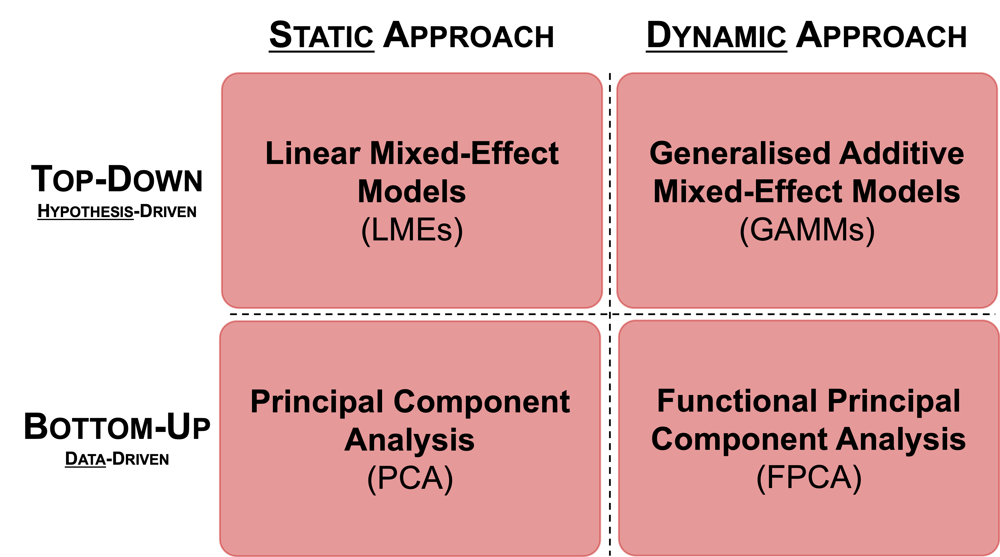
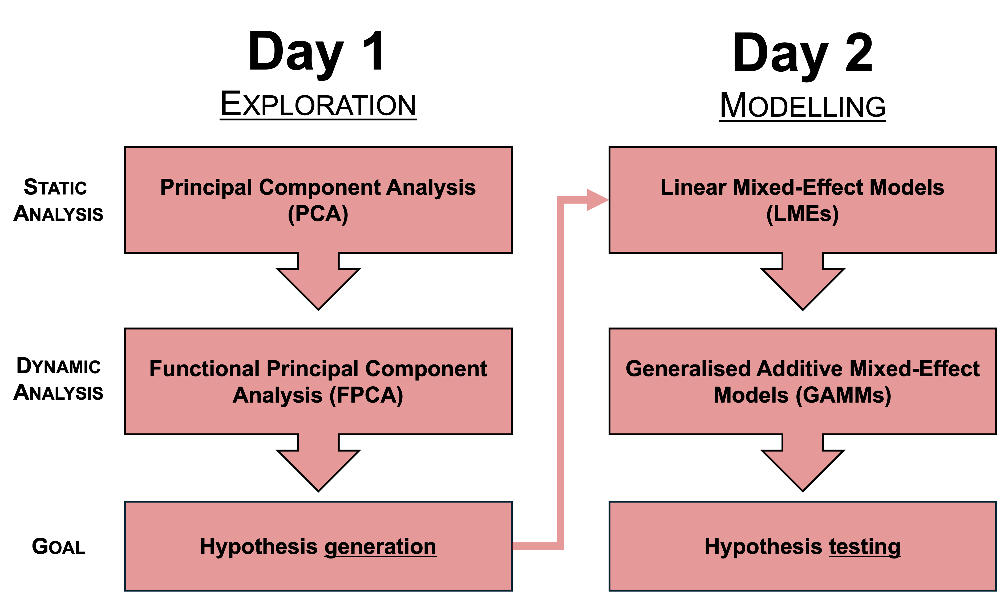
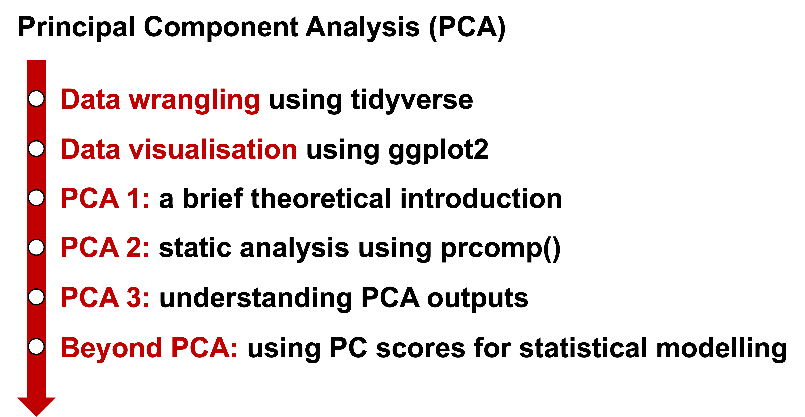

```{r include=FALSE}
install.packages("rmdformats")
install.packages("ggpubr")
install.packages("knitr")
install.packages("tidyverse")
install.packages("lme4")
install.packages("lme4Test")
install.packages("emmeans")
```


```{r include=FALSE}
library(rmdformats)
library(tidyverse)

# setting the plot theme globally
theme_set(theme_classic())

# define colour-blind-friendly colour palette 
cbPalette <- c("#000000", "#E69F00", "#56B4E9", "#009E73", "#F0E442", "#0072B2", "#D55E00", "#CC79A7")
```


# Introduction

Welcome to the workshop **Analysing contours in phonetic data: Dynamic analysis hands-on workshop using R**! In this workshop, we are going to study two main approachces to dynamic data analysis that are often used in phonetics.

The overarching aim of this workshop is to enable you to attempt different approaches to analysing phonetic data. Specifically, I aim to showcase the following contrasts in data analysis methods:

## 1. **Static** vs **dynamic** data analysis

Static analysis is a common approach to formant analysis in phonetics research. It is often the case, for example, that we extract formant frequencies during a vocalic interval at a single point in time (e.g., segmental onset, temporal midpoint). This is a farily prevalent approach and it is useful when we try to understand general and abstract properties of segments.

While static analysis is a somewhat easy and computationally less expensive approach, this inevitably involves some degrees of data loss/compression. Recent studies have increasingly demonstrated that **time-varying** properties in speech signals provide rather fine-grained phonetic details that may be important to better understand e.g., synchronic and diachronic variation and change, and cross-linguistic differences/influences in the acquisition of phonetics/phonology. And this is where dynamic analysis methods will come in handy, in which we directly model non-linearity in the data without having to compress/losing much information. My motto in dynamic analysis is **modelling what you see**.

## 2. **Top-down** vs **bottom-up** approaches to statistical modelling

Another contrast that will be discussed in this workshop is the difference in the way we deal with hypotheses. On the one hand, we may be interested in seeing what the data show us when we do not have any prior knowledge. In other words, our study can be **exploratory**, and we sometimes prefer **data-driven** (or **bottom-up**) approach to identifying key variables of interest, which then feed hypothesis/research question generations. 

On the other hand, statistical modelling can start with formulating hypotheses and research questions based on some existing ideas of key variables of interest, which could derive from e.g., previous research. In a way, this process involves a **top-down** decision making, and hypothesis testing involves asking whether the key variables of interest have a (statistically) significant effect in distinguishing two different populations. 

The contrast between bottom-up (data-driven) and top-down (hypothesis-driven) approaches to data analysis influence the nature of research questions that can be asked using each method. 

## Summary

In the next two days, we will be mainly discussing four statistical methods corresponding to the contrasts above.

1. **Principal Component Analysis** (PCA) : **static** and **bottom-up** approach
  
2. **Functional Principal Component Analysis** (FPCA): **dynamic** and **bottom-up** approach

3. **Linear Mixed-Effect Models** (LMEs): **static** and **top-down** approach

4. **Generalised Additive Mixed-Effect Models** (GAMMs) : **dynamic** and **top-down** approach


```{r echo=FALSE, fig.align='center', out.width="75%"}


```


Note that I do not wish to advocate one method over another: the main objective of this workshop is for us to experience that the same sets of data can be analysed differently, that data visualisation can look different, and that we can ask different research questions from the same sets of data. 

In the next section, I will introduce a problem that we will be working on in the course of the workshop. Given the nature of my expertise, I only manage to contexualise the workshop on a somewhat specific research topic, but hopefully the workshop offers something exciting for everyone! 

# Contexualising the workshop

## L1 Japanese speakers' production of L2 English /l/ and /ɹ/

I contexualise this workshop broadly in the second language (L2) speech learning. More specifically, my research addresses the ''Japanese /r/-/l/ problem'' (Flege, Aoyama & Bohn, 2021, p. 84). There is a long history of research on this topic, in which the first well-known, influential empirical studies could date back to 1970's (e.g., Goto et al., 1971; Miyawaki et al., 1975). Up until today, lots of researchers have worked on this topic to explain the substantial difficulty that L1 Japanese speakers have in perceiving and producing L2 English liquids (e.g., Sheldon & Strange, 1982; Flege et al., 1995; Bradlow et al., 1997; 1999; Iverson et al., 2003; Aoyama et al., 2004; Saito & Munro, 2014; Saito & van Poeteren, 2018; Shinohara & Iverson, 2018; Aoyama et al., 2019; Aoyama et al., 2023). 

## Overarching question

There have been quite a few studies investigating L1 Japanese speakers' production of L2 English liquids. To our surprise, however, there are not many studies in which the production data are analysed instrumentally using acoustic and/or articulatory methods. Previous instrumental acoustic studies would include: Flege et al. (1995), Saito and Munro (2014), Saito and van Poeteren (2018), Aoyama et al. (2019), Aoyama et al. (2023). This list is not exhaustive but does cover pretty much the main ones out there. 

These studies commonly utilise **static** analysis in characterising the acoustic profiles of L1 Japanese speakers' production of L2 English liquids. Thanks to these studies, we now understand the general acoustic properties involved in the production. These studies, however, have not managed to explain **how** and **why** L1 Japanese speakers end up producing non-target-like L2 English liquids. 

So, in this workshop, we will explore ways to better explain the mechanism as to why L1 Japanese speakers have substantial difficulty in producing L2 English liquids in a target-like manner based on acoustic data. To rephrase this into a question:

**What is the underlying mechanism of the L1 Japanese speakers' difficulty in producing L2 English liquids in a target-like manner?**

## Workshop structure

In this two-day workshop, I hope to go through the whole procedure of data analysis from **hypothesis generation** to **hypothesis testing**. On Day 1, you will be faced with a new, unfamiliar data set, so we will **explore** the data structure and **identify** salient acoustic dimensions that are important in addressing the question. **PCA** and **FPCA** are strong tools at this stage for static and dynamic analyses. At the end of the day, ideally, we will be able to generate a hypothesis regarding between-group differences with specific acoustic parameters. On Day 2, we will **model** and **test** the hypothesis generated on Day 1 using **LMEs** and **GAMMs**. 

```{r echo=FALSE, fig.align='center', out.width="75%"}


```

## Workshop materials

In this workshop, we will be using the materials from one of my previous publications. Data and codes for the analysis are publicly available on the Open Science Framework (OSF) repository, and we will retrieve the data sets from there.

If interested, the article can be accessed here (open access):

Nagamine, T. (2024). Formant dynamics in second language
speech: Japanese speakers’ production of English liquids. *The Journal of the
Acoustical Society of America, 155*(1), 479–495. https://doi.org/10.1121/10.0024351

Here is the URL for the online supplementary materials deposited on the following OSF repository:

https://osf.io/2phx5/

# Statistics basics

Now, let's start the fun part: data analysis! As mentioned earlier, we will build things up from the static analysis before going into the dynamic analysis. 

I assume that people have varying degrees of experience in statistics, so let's cover some basics first, including:

- **Mean** and **median**

- **Standard deviation (SD)**

- **Linear vs non-linear data**

- **Data visualisation basics**: scatter, box and violin plots.

## Mean and median: the distribution "centre"

The most common parameters in describing a given set of data are **mean** and **median**. Assuming the normal distribution, the most common type of data distribution in statistics, both mean and median represent something like **the midpoint**. But they differ in a small detail:

- **Mean**: the sum of all values divided by the number of values. Sensitive to extreme values.

- **Median**: the middle value when lining up all the data points from the smallest to the greatest. More robust to extreme values than the mean.

The figures below illustrate mean and median values in (1) normal and (2) right skewed distributions. You can see that mean and median values match on the normal distribution (left plot), whereas the mean score is 'attracted' towards the extreme values towards the left (right plot).  

```{r echo=FALSE, warning=FALSE, message=FALSE}
# Load necessary packages
library(tidyverse)
library(ggpubr)

# Set seed for reproducibility
set.seed(123)

# Generate data
data_normal <- tibble(
  distribution = "Normal",
  values = rnorm(1000, mean = 50, sd = 10)  # Symmetric distribution
)

data_skewed <- tibble(
  distribution = "Right-Skewed",
  values = rlnorm(980, meanlog = 6, sdlog = 1.2)  # More extreme right skew
)

# compute summary statistics
stats_normal <- data_normal |> 
  dplyr::summarise(
    mean_value = mean(values),
    median_value = median(values)
  )
  
stats_skewed <- data_skewed |> 
  dplyr::summarise(
    mean_value = mean(values),
    median_value = median(values)
  )

# plot histograms with mean & median
normal_plot <- ggplot(data_normal, aes(x = values)) +
  geom_histogram(aes(y = ..density..), bins = 30, fill = "skyblue", color = "black", alpha = 0.4) +
  geom_vline(data = stats_normal, aes(xintercept = mean_value, color = "Mean"), linetype = "dashed", linewidth = 1.2) +
  geom_vline(data = stats_normal, aes(xintercept = median_value, color = "Median"), linetype = "solid", linewidth = 1.2) +
  # facet_wrap(~ distribution, scales = "free") +
  scale_color_manual(values = cbPalette) +
  labs(title = "Normal Distribution",
       x = "Value",
       y = "Density",
       color = "Statistic")

skewed_plot <- ggplot(data_skewed, aes(x = values)) +
  geom_histogram(aes(y = ..density..), bins = 30, fill = "skyblue", color = "black", alpha = 0.4) +
  geom_vline(data = stats_skewed, aes(xintercept = mean_value, color = "Mean"), linetype = "dashed", linewidth = 1.2) +
  geom_vline(data = stats_skewed, aes(xintercept = median_value, color = "Median"), linetype = "solid", linewidth = 1.2) +
  # facet_wrap(~ distribution, scales = "free") +
  scale_color_manual(values = cbPalette) +
  xlim(c(0, 5000)) +
  labs(title = "Skewed Distribution",
       x = "Value",
       y = "Density",
       color = "Statistic")

ggpubr::ggarrange(normal_plot, skewed_plot, common.legend = TRUE, legend = "right")
```


## Standard deviation: the distribution "spread"

Along with the mean and median values, we often encounter **standard deviation (SD)**. SD captures the degree of ''spread'' of a given distribution, or the distance from the mean in the distribution. 

SD tells us the degree of data coverage. For example, one of the distributions shown below has the mean of 50 and the SD of 30 (in the skyblue colour). This indicates that 68% of the data points are covered between -1SD and +1SD: that is, between 50 - 30 = **20** and 50 + 30 = **80**. 

Similarly, 95% of the data points are included within ±2SDs. In the skyblue distribution below, 95% of the data are covered between 50 - 30 $\times$ 2 = **-10** and 50 + 30 $\times$ 2 = **110**. Usually, the larger SD is, the more spread the distribution looks. 

```{r echo=FALSE, warning=FALSE, message=FALSE}
# Load necessary packages
library(tidyverse)

# Set seed for reproducibility
set.seed(123)

# Generate three normal distributions with the same mean but different SDs
data_sd <- tibble(
  sd_5  = rnorm(1000, mean = 50, sd = 5),
  sd_15 = rnorm(1000, mean = 50, sd = 15),
  sd_30 = rnorm(1000, mean = 50, sd = 30)
) %>%
  pivot_longer(cols = everything(), names_to = "Standard_Deviation", values_to = "Value") %>%
  mutate(Standard_Deviation = factor(Standard_Deviation, 
                                     levels = c("sd_5", "sd_15", "sd_30"),
                                     labels = c("SD = 5", "SD = 15", "SD = 30")))

# Plot density curves for each SD
ggplot(data_sd, aes(x = Value, fill = Standard_Deviation)) +
  geom_density(alpha = 0.5) +  # Transparency for overlapping areas
  geom_vline(xintercept = 50, linetype = "dashed", color = "black", linewidth = 1) +  # Mean line
  geom_vline(xintercept = 0, linetype = "dotted", color = "black", linewidth = 0.5) +  # zero
  scale_fill_manual(values = cbPalette) +  # Custom colors
  labs(title = "Effect of Standard Deviation on Normal Distributions",
       subtitle = "All distributions have the same mean (50) but different standard deviations",
       x = "Value",
       y = "Density",
       fill = "Standard Deviation")
```

## Linear vs non-linear data

Let's take a quick look into what it means by 'linear' and 'non-linear' data. Both are the terms used to explain the relationship between two variables. A linear relationship can be expressed as a straight line, whereas a non-linear relationship requires a curve (or a contour).

The figure below exemplifies a linear and a non-linear relationship between X and Y. Generally, the plot with dots like this is called **'scatter plots'**. Here, the black dots show a linear relationship, where a certain amount of increase in X corresponds to another certain amount of increase in Y, and this X-Y correspondence is consistent throughout the range of X/Y values. This linear relationship can be expressed using a straight (black) line.

The yellow dots, on the other hand, show a non-linear relationship between X and Y variables. Although an increase in X corresponds to another increase in Y like in the linear data, the relationship is not consistent, especially towards the end of the x-axis. This relationship cannot be captured with a single line (compare the solid and dotted lines in yellow).

```{r echo=FALSE, warning=FALSE, message=FALSE}
# Load necessary packages
library(tidyverse)

# Simulate a dataset
set.seed(123)

data <- tibble(
  group = rep(c("A", "B"), each = 50),
  x = rnorm(100, mean = 50, sd = 10),
  y_linear = 2 * x + rnorm(100, sd = 5),         # Linear relationship
  y_nonlinear = 0.05 * x^2 + rnorm(100, sd = 10) # Nonlinear relationship
)

# Compute basic statistics
stats <- data |> 
  dplyr::group_by(group) |>
  dplyr::summarise(
    mean_x = mean(x),
    median_x = median(x),
    sd_x = sd(x),
    iqr_x = IQR(x)
  )

# Plot 1: Scatter plot with linear and nonlinear smoothers
ggplot(data, aes(x = x)) +
  geom_point(aes(y = y_linear, color = "Linear"), alpha = 0.7) +
  geom_point(aes(y = y_nonlinear, color = "Nonlinear"), alpha = 0.7) +
  geom_smooth(aes(y = y_linear, color = "Linear"), method = "lm", se = FALSE, linewidth = 1) +
  geom_smooth(aes(y = y_nonlinear, color = "Nonlinear"), method = "loess", se = FALSE, linewidth = 1) +
  geom_smooth(aes(y = y_nonlinear, color = "Nonlinear"), method = "lm", se = FALSE, linewidth = 0.5, linetype = "dashed") +
  labs(title = "Linear vs. Nonlinear Relationships with Smoothers",
       x = "X Variable",
       y = "Y Variable") +
  scale_color_manual(values = cbPalette)
```


## Data visualisation: scatter, box and violin plots

Finally, let's take a quick look at data visualisation methods. I consider that data visualisation is the pivot in data analysis, and a great data analysis is facilitated by effective data visualiastion. It is also a means to communicate the research findings with the audience. 

Effective data visualisation often combines multiple types of plots. In my usual practice, I often combine three types of plots: **scatter**, **box** and **violin** plots.

1. **Scatter plot**: In the figure below, the dots in skyblue colour represents individual data points. The mean value of the data is expressed as &#9650;.

2. **Box plot**: Superimposed on them is the **box plot**. The box plot consists of a rectangle box, a solid horizontal line in the middle of the box, and 'whiskers' at the top and bottom of the box. Each of them represents key parameters of a distribution:

- The solid horizontal line represents **median**, which corresponds to the **second quartile** (Q2).

- Each end of the box represents **first** (Q1) and **third quartiles** (Q3), and the distance between Q1 and Q3 is called **interquartile range** (IQR). Broadly speaking, you could understand that the box covers the middle 50% of the data, which is divided into half by the solid black line. The lower end of the box is the first quartile (Q1) and the upper end is the third quartile (Q3). 

- The length of the whiskers below and above the box is determined such that:

  - Lower end: Q1 - 1.5 $\times$ IQR
  
  - Upper end: Q3 + 1.5 $\times$ IQR

3. **Violin plot**: Finally, the violin plot shows the density of the data distribution. 

```{r echo=FALSE, warning=FALSE, message=FALSE}
# Load necessary packages
library(tidyverse)

# Set seed for reproducibility
set.seed(123)

# Generate data: Normal distribution with some random noise
data <- tibble(
  values = rnorm(1000, mean = 50, sd = 15)
)

# Calculate mean, median, and IQR for reference
summary_stats <- data |> 
  summarise(
    mean_value = mean(values),
    median_value = median(values),
    q1 = quantile(values, 0.25),
    q3 = quantile(values, 0.75),
    iqr = q3 - q1
  )

# Plot: Show mean, median, and IQR with geom_point, geom_boxplot, and geom_violin
ggplot(data, aes(x = 1, y = values)) +
  # Add jittered points with cbPalette[3] (light blue)
  geom_jitter(alpha = 0.4, color = cbPalette[3], width = 0.3, height = 0.1) +
    # Add violin plot for distribution with cbPalette[6] (blue)
  geom_violin(aes(x = 1, y = values), fill = cbPalette[6], alpha = 0.2) +
  # Add boxplot for IQR with cbPalette[4] (green)
  geom_boxplot(
    aes(x = 1, y = values), 
    width = 0.2, 
    fill = "grey", 
    alpha = 0.7, 
    outlier.shape = NA  # Hide default outliers since we're adding points separately
  ) +
  # Highlight the mean with cbPalette[1] (black)
  geom_point(
    data = summary_stats, 
    aes(x = 1, y = mean_value), 
    color = cbPalette[1], 
    size = 4, 
    shape = 17
  ) +
  # Add lines for Q1 and Q3 (IQR) with cbPalette[7] (orange-red)
  geom_segment(
    data = summary_stats,
    aes(x = 0.8, xend = 1.2, y = q1, yend = q1),
    color = cbPalette[7], size = 1, linetype = "dashed"
  ) +
  geom_segment(
    data = summary_stats,
    aes(x = 0.8, xend = 1.2, y = q3, yend = q3),
    color = cbPalette[7], size = 1, linetype = "dashed"
  ) +
    # Add text labels for mean, median, and IQR (Q1 and Q3)
  geom_text(
    data = summary_stats, 
    aes(x = 1.25, y = median_value, label = paste("Median (Q2) =", round(median_value, 2))), 
    color = cbPalette[1], size = 4, hjust = 0
  ) +
  geom_text(
    data = summary_stats, 
    aes(x = 1.25, y = q1, label = paste("Q1 =", round(q1, 2))),
    color = cbPalette[7], size = 4, hjust = 0
  ) +
  geom_text(
    data = summary_stats, 
    aes(x = 1.25, y = q3, label = paste("Q3 =", round(q3, 2))),
    color = cbPalette[7], size = 4, hjust = 0
  ) +
  labs(
    title = "Mean, Median, and Interquartile Range",
    subtitle = "Highlighted on Jittered, Boxplot, and Violin Plots",
    x = "Distribution",
    y = "Values"
  ) +
  theme(axis.title.x = element_blank(), axis.text.x = element_blank())  # Hide x-axis labels
```


# PCA: Roadmap

OK, so much for the basics, and let's turn to **bottom-up**, exploratory approaches to data analysis using **principal component analysis (PCA)**.

These tools can be useful when (1) reducing data dimensions into a manageable number of variables and (2) identifying the degrees to which each parameter contributes to the data structure. 

Here is the brief road map in the rest of the section:

```{r echo=FALSE, fig.align='center', out.width="75%"}


```

We will run up to PCA in a moment, but let's start with spending some time understanding data through **data wrangling**.

# Preliminaries

## Installing/loading packages

Let's first install and load R packages that we are using in the static analysis section. The installation commands have been commented out, but please uncomment them and install the packages if you do not have them on your machine yet. We won't need any specialised package for PCA as it is included as a base function. 

```{r warning=FALSE, message=FALSE}
# installing
# install.packages("tidyverse")
# install.packages("lme4")
# install.packages("lme4Test")
# install.packages("emmeans")

# importing
library(tidyverse)
# library(lme4)
# library(lmerTest)
# library(emmeans)
```


## Importing data set

Let's import the data set. We are using the data set openly available on the Open Science Framework (OSF) repository.

```{r message=FALSE}
# import the csv file "initial.liquid.static.csv" from the "data" directory and save it as "df_mid"
df_mid <- readr::read_csv("data/initial.liquid.static.csv")

# whole data set
View(df_mid)

# partial view
df_mid
```

# Checking data

It's always a good idea to spend some time inspecting the data set. I usually start with checking the column names using ```colnames()```. 

```{r}
# Let's check what columns the data frame contains
colnames(df_mid)
```

According to the code above, the data frame contains the following columns:

- **file**: The name of source audio files. A legacy information from the acoustic analysis.

- **speaker**: Randomly generated speaker IDs consisting of a combination of letters and numbers. 

- **language**: Speaker's first language: either English or Japanese

- **duration**: Duration of the liquid phoneme.

- **segment**: Types of the segment, either L (/l/) or R (/ɹ/)

- **word**: Words that the speakers produced. 

- **f1**, **f2** and **f3**: Formant frequencies in Hz.

- **previous_sound**: The sound occurring before the word-initial liquid consonant. Empty as the words were uttered in isolation. 

- **next_sound**: The sound occurring after the word-initial liquid consonant. In this case, this shows vowel context. 

- **percent**: Proportional time during the liquid consonant. The data set only contains midpoint measurement, so this should be all **50**(%).

- **IsApproximant**: Auditory and visual judgement (based on the spectrogram) as to whether the liquid consonant can be classified as an approximant or not (i.e., an alveolar stop or flap). 

- **IsAcoustic**: Auditory and visual judgement as to the clarity/visibility of the formant structure on the spectrogram. Broadly corresponding to the recording quality.

- **gender**: Speakers' gender. Either male or female.

- **omit**: The column indicating whether acoustic analysis tool omitted the token from the analysis. Irrelevant for the purpose of this workshop. 

- **position**: The syllabic (or word) position of the liquid consonant. All should be **initial**. 

# Data tidy-up: tidyverse basics

There are a number of columns in the data set but not all of them are relevant throughout. Let's tidy up the data frame so that the subsequent analysis will be more straightforward. 

## Check data

First, we will inspect a summary of the data according to the columns that we have so far. Although not the most efficient, my approach is to combine ```dplyr::group_by()``` and ```dplyr::summarise()``` functions to summarise the data. 

Do not forget ```dplyr::ungroup()``` at the end of each operation, too!

```{r}
# Let's check the number of "approximant" tokens
df_mid |> 
  dplyr::group_by(IsApproximant) |> 
  dplyr::summarise() |> 
  dplyr::ungroup()

# Let's check the number of tokens of good recording quality
df_mid |> 
  dplyr::group_by(IsAcoustic) |> 
  dplyr::summarise() |> 
  dplyr::ungroup()

# How about 'omit'?
df_mid |> 
  dplyr::group_by(omit) |> 
  dplyr::summarise() |> 
  dplyr::ungroup()
```

## Omitting irrelavent columns

The codes above show that the data set only contains liquid tokens that are classified as an approximant, deemed as being of good recording quality and thus included in the acoustic analysis. This means that we can safely remove these columns. Let's do this via ```dplyr::select()``` function. After that, we check the column names again using ```colnames()```, showing that the three columns have been safely removed from the data frame. 

```{r}
# Remove columns 
df_mid <- df_mid |> 
  dplyr::select(-c(IsApproximant, IsAcoustic, omit))

df_mid <- df_mid |> 
  dplyr::select(-position)
```

### Your turn

Please write a code below to check the updated column names:

```{r}
# Check column names again
colnames(df_mid)
```

## Renaming variables

Later on in this workshop, we will be modelling the formant frequencies as a function of vowel context. In terms of the current data set, this corresponds to the **next_sound** column, but let's rename it into **vowel** to make it more intuitive. 

Also, we will also convert the ARPABET notations into the IPA symbols. 

```{r}
# check next_sound
df_mid |> 
  dplyr::group_by(next_sound) |> 
  dplyr::summarise() |> 
  dplyr::ungroup()

# 'recoding' using mutate
df_mid <- df_mid |> 
  dplyr::mutate(
    vowel = case_when(
      next_sound == "AE1" ~ "/æ/",
      next_sound == "IY1" ~ "/i/",
      next_sound == "UW1" ~ "/u/",
    )
  )

# check the resulted 'vowel' column
df_mid |> 
  dplyr::group_by(vowel) |> 
  dplyr::summarise() |> 
  dplyr::ungroup()
```


## Checking the number of participants, tokens...

Let's also obtain some descriptive statistics here.

```{r}
# number of participants
df_mid |> 
  dplyr::group_by(language) |> 
  dplyr::summarise(n = n_distinct(speaker)) |> 
  dplyr::ungroup()

# command/ctrl + shift + m
# |> 
  
# number of tokens per segment
df_mid |> 
  dplyr::group_by(segment) |> 
  dplyr::summarise(n = n()) |> 
  dplyr::ungroup()
```

### Your turn

Is there anything else that you would like to know about the data set?

You can start with checking the column names to see what variables are available in the data set. Then, use ```dplyr::group_by()```, ```dplyr::summarise()``` and ```dplyr::ungroup()``` functions to inspect the data.

```{r}
# Check data further
df_mid |> 
  dplyr::group_by(language, segment, vowel) |> 
  dplyr::summarise(n = n()) |> 
  dplyr::ungroup()

?n_distinct
```


# Data visualisation: ggplot basics

Hopefully, you start to become relatively familiar with the data set through the checking and tidying-up process above. Now, in order to understand the overall trend of the data, let's try some data visualisation. I heavily rely on the ```ggplot2``` package in the ```tidyverse``` suite. 

## Preparation

Before visualising the data, we need to make sure that the formant frequencies are comparable across speakers. We know that we cannot directly compare raw formant frequencies because they are heavily influenced by the vocal tract characteristics depending on the speaker's gender, sex, height etc. 

To address this, let's normalise the formant frequencies across speakers. There are various normalisation methods, but today we are just using **z-score** normalisation, in which **the mean value** for each speaker is expressed as zero and **the standard deviation** is scaled to one. This can be achieved via ```scale()``` function included in base R. 

Let's create ```f1z```, ```f2z``` and ```f3z``` columns using the ```dplyr::mutate()``` function. When doing this, make sure that you do the scaling for each speaker by specifying ```dplyr::group_by(speaker)```.

```{r}
df_mid <- df_mid |> 
  dplyr::group_by(speaker) |> # tell R to do the following iteration per speaker
  dplyr::mutate(
    # f1z = scale(f1), # scale f1 into z-score
    f1z = scale(as.numeric(f1)),
    f2z = scale(f2), # scale f2 into z-score
    f3z = scale(f3)# scale f3 into z-score
  ) |> 
  dplyr::ungroup() # don't forget ungrouping
```

Let's check the mean and SD for both raw and normalised formant values: just see F1 for now. Note that the mean z-scores do not seem to look zero, but this is because computers are not very good at dealing with very small numbers (e.g., decimals) and some fluctuations occur in computing the values.

```{r}
# check mean and sd of raw/scaled F1 values for each speaker
df_mid |> 
  dplyr::group_by(speaker) |>
  dplyr::summarise(
    f1_mean = mean(f1),
    f1_sd = sd(f1),
    f1z_mean = mean(f1z),
    f1z_sd = sd(f1z)
  ) |> 
  dplyr::ungroup() 
```

### Your turn

Write a code chunk to inspect the mean and sd of raw/scaled F2 and F3 values for each **speaker** and for **speaker group**. Think how you group the data in ```dplyr::group_by()```.

```{r}
# check mean and sd of raw/scaled F2 values for each speaker group
df_mid |> 
  dplyr::group_by(speaker) |>
  dplyr::summarise(
    f2_mean = mean(f2),
    f2_sd = sd(f2),
    f2z_mean = mean(f2z),
    f2z_sd = sd(f2z)
  ) |> 
  dplyr::ungroup() 

# check mean and sd of raw/scaled F3 values for each speaker group
df_mid |> 
  dplyr::group_by(speaker) |>
  dplyr::summarise(
    f3_mean = mean(f3),
    f3_sd = sd(f3),
    f3z_mean = mean(f3z),
    f3z_sd = sd(f3z)
  ) |> 
  dplyr::ungroup() 
```

## Visualisation: Spectral characteristics

We can now compare F1 values across participant groups for each segment (/l/ and /ɹ/). For clearer visualisation, the following codes define the range of y-axis between -4 and 4, and some extreme values have been omitted from the plot. 

In the code below, I visualise the ```f1z``` values using the scatter, box and violin plots. The line with ```ggplot()``` defines x- and y-axis, and the following three lines with ```geom_jitter()```, ```geom_violin()``` and ```geom_boxplot()``` superimpose the plot on top of each other and define aesthetic. ```facet_grid()``` divides the plot into multiple levels of a variable to understand differences across conditions. 


```{r warning=FALSE}
# F1
df_mid |> 
  # define x- and y-axis
  ggplot(aes(x = language, y = f1z)) +
  # scatter plot
  geom_jitter(aes(colour = language), width = 0.3, alpha = 0.4) +
  # superimposing violin plot on scatter plot
  geom_violin(alpha = 0.4) +
  # # superimposing boxplot on scatter/violin plots
  geom_boxplot(width = 0.4, alpha = 0.4) +
  # # drawing a horizontal line at y = 0 to facilitate interpretation
  geom_hline(yintercept = 0, linetype = "dashed", linewidth = 0.5) +
  # # define colour scheme
  scale_colour_manual(values = cbPalette) + 
  # # define limits on the y-axis
  ylim(c(-4, 4)) +
  # # split the plot according to the ``segment`` and ``vowel`` variables
  facet_grid(segment ~ vowel) +
  # # define axis and main labels
  # labs(x = "L1", y = "F1 (z-normalised)", title = "F1 frequency") +
  # adjust the label on the y-axis to make it look better
  theme(strip.text.y = element_text(angle = 0))
```

### Your turn

Could you try visualising ```f2z``` and ```f3z```?

```{r}
# F2
df_mid |> 
  # define x- and y-axis
  ggplot(aes(x = language, y = f2z)) +
  # scatter plot
  geom_jitter(aes(colour = language), width = 0.3, alpha = 0.4) +
  # superimposing violin plot on scatter plot
  geom_violin(alpha = 0.4) +
  # # superimposing boxplot on scatter/violin plots
  geom_boxplot(width = 0.4, alpha = 0.4) +
  # # drawing a horizontal line at y = 0 to facilitate interpretation
  geom_hline(yintercept = 0, linetype = "dashed", linewidth = 0.5) +
  # # define colour scheme
  scale_colour_manual(values = cbPalette) + 
  # # define limits on the y-axis
  # ylim(c(-4, 4)) +
  # # split the plot according to the ``segment`` and ``vowel`` variables
  facet_grid(segment ~ vowel) +
  # # define axis and main labels
  labs(x = "L1", y = "F2 (z-normalised)", title = "F2 frequency") +
  # adjust the label on the y-axis to make it look better
  theme(strip.text.y = element_text(angle = 0))

# F3
df_mid |> 
  # define x- and y-axis
  ggplot(aes(x = language, y = f3z)) +
  # scatter plot
  geom_jitter(aes(colour = language), width = 0.3, alpha = 0.4) +
  # superimposing violin plot on scatter plot
  geom_violin(alpha = 0.4) +
  # # superimposing boxplot on scatter/violin plots
  geom_boxplot(width = 0.4, alpha = 0.4) +
  # # drawing a horizontal line at y = 0 to facilitate interpretation
  geom_hline(yintercept = 0, linetype = "dashed", linewidth = 0.5) +
  # # define colour scheme
  scale_colour_manual(values = cbPalette) + 
  # # define limits on the y-axis
  # ylim(c(-4, 4)) +
  # # split the plot according to the ``segment`` and ``vowel`` variables
  facet_grid(segment ~ vowel) +
  # # define axis and main labels
  labs(x = "L1", y = "F3 (z-normalised)", title = "F3 frequency") +
  # adjust the label on the y-axis to make it look better
  theme(strip.text.y = element_text(angle = 0))

df_mid |>
  ggplot(aes(x=segment,y=f2z)) +
  geom_jitter(aes(colour=language), width=0.3, alpha=0.4) +
  geom_violin(alpha = 0.4) +
  facet_grid(rows = vars(vowel), cols = vars(language)) +
  scale_colour_manual(values = c("#7f0000","#00007f")) +
  labs(y="Second Formant, Normalized")
```

Overall, the data visualisation so far seems to suggest:

1. It seems that vowel contexts may influence the F1 values, such that the /æ/ context yields the overall highest F1 values. The two groups of speakers do not seem to exhibit clear differences along the F1 dimension. 

2. There also seems to be the effect of vowel context, in which F2 is overall highest in the /i/ context. L1 Japanese speakers seem to produce English liquids with higher F2 in the /i/ context and lower F2 in the /u/ context than L1 English speakers. 

3. Whereas F3 seems comparable between the two speaker groups for /l/, L1 Japanese speakers seem to produce English /ɹ/ with a little higher F3 than L1 English speakers, although the magnitude of such between-group differences seem to vary depending on the vowel context. 

## Exploring visualisation further

### Your turn

Data visualisation is a crucial aspect in data analysis and in open data science: Slight changes in data visualiastion would convey different messages to whoever see the plots. It is always beneficial (and fun!) to play around a little with ```ggplot```. So, let's stop for a moment and have a bit of fun in data visualisation. 

Explore different ways to visualise the F1, F2 and F3 values. For example, you could:

- throw different variables in the ```facet_grid()``` command

- plot raw F1, F2 and F3 values (i.e., simply typing ```f1``` instead of ```f1z```) to see how the two plots compare

- adjust the ```alpha``` values to see what happens 

- completely change the x/y axis labels

- change the order of ```geom_jitter()```, ```geom_violin``` and ```geom_boxplot()```, and/or comment out some of them to disable

- adjust the y-axis range by adjusting the numerics in ```ylim()```

- etc etc...

```{r}
# try your visualisation
# ...
```

## Correlation

Let's also take a slightly different approach. The objective of PCA is to draw straight lines along the dimension that shows the greatest **variance**. To inspect the variance in the data, we'll plot the relationships between the three spectral dimensions.

```{r}
# F1 and F2
df_mid |> 
  ggplot(aes(x = f1z, y = f2z)) +
  geom_point(aes(colour = segment), alpha = 0.4) +
  scale_colour_manual(values = cbPalette) +
  facet_wrap(~ language)

# F2 and F3
df_mid |> 
  ggplot(aes(x = f2z, y = f3z)) +
  geom_point(aes(colour = segment), alpha = 0.4) +
  scale_colour_manual(values = cbPalette) +
  facet_wrap(~ language)

# F1 and F3
df_mid |> 
  ggplot(aes(x = f1z, y = f3z)) +
  geom_point(aes(colour = segment), alpha = 0.4) +
  scale_colour_manual(values = cbPalette) +
  facet_wrap(~ language)
```

As expected, English /l/ and /ɹ/ can be reliably distinguished along the **F3** dimension, such that English /ɹ/ shows lower F3 than English /l/. 

## Temporal characteristics

OK, then how about ```duration```? Let's visualise them first, and then check how it correlates with each of the spectral parameters. We'll use the original ```df_mid``` data frame again but convert the duration into millisecond.

### Violin plot

```{r}
# convert duration (s) into (ms)
df_mid <- df_mid |> 
  dplyr::group_by(speaker) |> 
  dplyr::mutate(
    duration_ms = duration * 1000,
    duration_ms_z = scale(duration_ms)
  ) |> 
  dplyr::ungroup()

# plot
df_mid |> 
  ggplot(aes(x = language, y = duration_ms_z)) +
  geom_jitter(aes(colour = language), alpha = 0.5) +
  geom_violin(alpha = 0.4) +
  geom_boxplot(width = 0.3, alpha = 0.4) +
  facet_grid(~ segment) +
  scale_colour_manual(values = cbPalette)
```

### Correlation

Let's also check whether duration correlates with any of the spectral measures.

```{r}
# with F1 
df_mid |> 
  ggplot(aes(x = f1z, y = duration_ms_z)) +
  geom_point(aes(colour = language), alpha = 0.4) +
  scale_colour_manual(values = cbPalette) +
  facet_grid(segment ~ language) +
  theme(strip.text.y = element_text(angle = 0))

# with F2
df_mid |> 
  ggplot(aes(x = f2z, y = duration_ms_z)) +
  geom_point(aes(colour = language), alpha = 0.4) +
  scale_colour_manual(values = cbPalette) +
  facet_grid(segment ~ language) +
  theme(strip.text.y = element_text(angle = 0))

# with F3
df_mid |> 
  ggplot(aes(x = f3z, y = duration_ms_z)) +
  geom_point(aes(colour = language), alpha = 0.4) +
  scale_colour_manual(values = cbPalette) +
  facet_grid(segment ~ language) +
  theme(strip.text.y = element_text(angle = 0))
```

Mmm, we do not seem to find particularly interesting correlations here. But this is fine for now, as we're just exploring this. The key takeaway here is that we always need **multiple** plots in order to obtain a holistic understanding of the data structure, which is somewhat cumbersome. Here, PCA comes in handy, as it is a **dimension reduction** technique and boils down the variance in the data into a handful of **principal components**. 

# Principal Component Analysis (PCA)

**Principal Component Analysis (PCA)** is a dimensionality reduction technique that transforms data into a new coordinate system. Given data points that show relationships between two or more variables (e.g., x and y), PCA identifies new axes (**principal components, PCs**) that capture the maximum variance in the data:

- PC1 (first principal component) captures the direction of the greatest variance in the data.

- PC2 (second principal component) is perpendicular (orthogonal) to PC1 and captures the second largest variance.

If there are more dimensions, additional principal components (PC3, PC4, etc.) are defined similarly, always orthogonal to the previous ones.

After identifying these new principal components, the data is re-expressed in terms of these new axes. This effectively rotates the coordinate system so that PC1 aligns with the new x-axis and PC2 with the new y-axis. However, the relative positions of the data points remain unchanged.

```{r echo=FALSE, warning=FALSE, mesage=FALSE}
# Load necessary libraries
library(ggplot2)
library(tidyverse)

# Set seed for reproducibility
set.seed(40)

# Generate correlated data
n <- 100
x <- rnorm(n, mean = 5, sd = 2)
y <- 0.5 * x + rnorm(n, mean = 0, sd = 1)

# Combine into a dataframe
data <- tibble(x, y)

# Perform PCA
pca <- prcomp(data, center = TRUE, scale. = FALSE)

# Extract principal component vectors
pc1 <- pca$rotation[,1] * 2  # Scaling for visualization
pc2 <- pca$rotation[,2] * 2

# PCA rotated data
data_pca <- as_tibble(pca$x) |> 
  rename(PC1 = PC1, PC2 = PC2)

# Original data with eigenvectors
p1 <- ggplot(data, aes(x, y)) +
  geom_point(alpha = 0.5) +
  geom_segment(aes(x = mean(x), y = mean(y), xend = mean(x) + pc1[1], yend = mean(y) + pc1[2]), arrow = arrow(length = unit(0.2, "inches")), color = "red", size = 1) +
  geom_segment(aes(x = mean(x), y = mean(y), xend = mean(x) + pc2[1], yend = mean(y) + pc2[2]), arrow = arrow(length = unit(0.2, "inches")), color = "blue", size = 1) +
  annotate("text", x = mean(x) + pc1[1] * 1.2, y = mean(y) + pc1[2] * 1.2, label = "PC1", color = "red", fontface = "bold", size = 5) +
  annotate("text", x = mean(x) + pc2[1] * 1.2, y = mean(y) + pc2[2] * 1.2, label = "PC2", color = "blue", fontface = "bold", size = 5) +
  ggtitle("Original Data with Principal Axes")

# Rotated data
p2 <- ggplot(data_pca, aes(PC1, PC2)) +
  geom_point(alpha = 0.5) +
  geom_hline(yintercept = 0, linetype = "dashed") +
  geom_vline(xintercept = 0, linetype = "dashed") +
  ggtitle("Data in Rotated PCA Space")

# Plot the two graphs side by side
ggpubr::ggarrange(p1, p2)

# Verify orthogonality of PC1 and PC2
# dot_product <- sum(pca$rotation[,1] * pca$rotation[,2])
# print(dot_product)  # Should be very close to 0
```


Let's apply PCA on the formant data. We'll classify the tokens based on the z-scored F1, F2 and F3. We use the ```prcomp()``` function to perform PCA.

In the ```prcomp()``` function, there is a ```scale``` argument, and it is generally recommended that you set this into ```scale = TRUE```. This influences not only the unit standardisation of the variables but also the internal computational methods for PCA. Since we deal with z-score normalised measures, this does not look like a big difference on the surface though. 

```{r}
# rearrange column order for easier data subsetting
df_mid <- df_mid |> 
  dplyr::relocate(f1z, f2z, f3z, duration_ms_z)

# check colnames
colnames(df_mid)

# PCA on F1z, F2z, F3z and duration
pca_mid <- prcomp(dplyr::select(df_mid, 1:4), scale = FALSE)

pca_mid_true <- prcomp(dplyr::select(df_mid, 1:4), scale = TRUE)

# check summary
summary(pca_mid)
```

The summary shows three rows:

- **Standard deviation**: This fundamentally shows the variance shown in the data. The greater the value, the more variance is captured by each PC.

- **Proportion of Variance**: This expresses the amount of variance explained by each PC in a proportional manner. This can be calculated with the following formulae:

$$
pca\_var\_exp = \frac{(\text{sdev})^2}{\sum pca\_var}
$$

- **Cumulative Proportion**: This simply shows the sum of the proportion of variance explained by each PC. For instance, PC1 explains 33.24% of variance whereas PC2 27.62%. The cumulative proportion of PC1 and PC2 is thus 60.86% (i.e., 33.24% + 27.62%).

Another important index in PCA is **eigenvalues**, which represent **how much variance is explained by each principal component (PC)**. The standard deviation of a PC is the square root of its eigenvalue, meaning that eigenvalues are the squared standard deviations of the PCs. The proportion of variance explained by a given PC is calculated by dividing its eigenvalue by the sum of all eigenvalues.

```{r}
# calculate eigenvalues
eigenvalues <- (pca_mid$sdev)^2

# show eigenvalues
eigenvalues

# calculating proportion of variance 
pca_var_exp <- eigenvalues / sum(eigenvalues)  # Proportion of variance

# show the proportion of variance explained by each PC
pca_var_exp
```

## PCA summary

Let's also look into the inside of ```pca_mid```.

```{r}
# show the PCA results
pca_mid

pca_mid_true
```

The top line shows **standard deviation**, which reflects the amount of variance explained by each principal component (PC). Let's skip this for now.

At the bottom, we have the **loadings matrix**, which shows the **eigenvectors**. (The name is confusing but this is how I understood.) These **eigenvectors** represent the direction and weight of each original variable's contribution to each principal component. The components of the eigenvectors (also known as **loadings**) give us a sense of how each variable is related to the PCs. Let's break this down further:

- **PC1**: Contributions of ```f1z```, ```f2z```, ```f3z``` and ```duration``` are all in the same direction (i.e., positive). But the amount of contribution is fairly small for ```f1z``` and ```duration``` compared to ```f2z``` and ```f3z```. 

- **PC2**: In contrast to PC1, ```f1z``` contributes to PC2 to a greater extent than ```f2z``` and ```f3z```. ```duration``` also seems to make a big contribution here but in the opposite direction (i.e., negative). This suggests that, the larger PC2 is, the higher F1 but the shorter the duration. 

- **PC3**: The contribution of ```duration``` seems quite big here, too. 

- **PC4**: ```f2z``` and ```f3z``` both seem to contribute to this dimension, although they are in antagonistic direction. 

So, all in all, PCA might suggest:

- **PC1** captures a covariation between ```f2z``` and ```f3z```, which may correspond to the spectral difference between /l/ and /ɹ/.

- **PC2** mainly captures a covariation of ```duration``` and ```f1z``` but in opposite directions.

- **PC3** shows variation in ```f1z```. 

- **PC4** again seems to capture ```f2z``` and ```f3z``` but in opposite directions. 

The interpretation may be better facilitated by data visualisation. Let's try two main approaches to data visualiastion of PCA. 

## Data visualisation 1: Scree plot

The amount of variance is useful when determining which PC to retain for analysis. As a rule of thumb, Bayeen (2008) recommends that we retain PCs that explains greater than 5% of variance in the data.

A useful visualisation of the proportion of variance is **scree plot**. There is a default function ```screeplot()``` that lets you create a scree plot quite easily:

```{r}
# scree plot: bar chart
screeplot(pca_mid)

# scree plot: line plot
screeplot(pca_mid, type = "line")
```

You can also create a scree plot using ```ggplot()``` by manually calculating the proportion of variance based on the standard deviation (see above for the formula). This is useful when you need more flexibility -- e.g., to show the 5% thereshold suggested by Bayeen (2008).

```{r}
## obtaining proportion of variance 
pca_var_exp <- pca_mid$sdev^2 / sum(eigenvalues)

# making var_explained as a tibble 
pca_var_exp <- tibble::as_tibble(pca_var_exp)

# adding column name
pca_var_exp <- pca_var_exp |>  
  tibble::as_tibble() |>  
  dplyr::mutate(
    PC = row_number()
  )

# create a plot
scree_plot <- pca_var_exp |> 
  ggplot(aes(x = PC, y = value)) +
  geom_line() +
  geom_text(aes(label = round(value, digits = 3)*100), nudge_x = 0, nudge_y = -0.02) +
  geom_label(aes(label = PC), label.padding = unit(0.40, "lines")) +
  geom_hline(yintercept = 0.05, linetype = 'dotted') +
  scale_x_continuous(breaks = c(1, 2, 3)) +
  labs(x = "Principal Component", y = "Variance Explained", title = "Proportion of Variance explained by each PC")

# showing plot
scree_plot
```
Since there are only three PCs identified from the data, it doesn't make much sense to visualise them. But this will be useful when ```prcomp()``` identifies more than a few PCs.

## creating biplot

The interpretation of loading matrix was more or less straightforward in this case given that only three parameters were involved. It is easy to see, however, that this can get quite complicated when the original data have a greater number of dimensions. 

**Biplots** help us better understand the loadings and PC scores for each observation. For example, the default function ```biplot()``` plots all observations along the PC1 and PC2 dimensions with the direction and the amount of weighting in red arrows -- **loadings** (as far as I understand). 

```{r}
# default function for biplot
biplot(pca_mid)
```

## Detailed biplots

Similarly to the scree plot, we could also create biplots manually using ```ggplot()```. This will help us better understand what each PC could stand for in the current data set.

```{r}
# Extract PCA scores (principal component scores for each observation)
pca_scores <- as.data.frame(pca_mid$x)

# Extract PCA loadings (the contribution of each original variable to the PCs)
pca_loadings <- as.data.frame(pca_mid$rotation)

# Combine scores into one data frame for plotting
scores_df <- cbind(pca_scores, df_mid[, c("segment", "speaker", "language", "vowel")])

# Reshape the loadings for visualization
loadings_df <- pca_loadings |> 
  mutate(variable = rownames(pca_loadings))

# Plotting the PCA biplot with facets by language
ggplot() +
  geom_point(data = scores_df, aes(x = PC1, y = PC2, color = segment, shape = segment), size = 2, alpha = 0.5) + # Plot the PCA scores (observations)
  geom_segment(data = loadings_df, aes(x = 0, y = 0, xend = PC1 * 5, yend = PC2 * 5), arrow = arrow(type = "closed", length = unit(0.1, "inches")), color = "red") + # Plot the loadings (variables)
  geom_text(data = loadings_df, aes(x = PC1 * 5, y = PC2 * 5, label = variable), size = 4, color = "red") + # Add labels for the loadings
  # stat_ellipse(data = scores_df, aes(x = PC1, y = PC2, color = vowel, fill = vowel), geom = "polygon", alpha = 0.2, level = 0.95) + 
  facet_grid(language ~ vowel) +
  labs(title = "PCA biplot by segment and vowel") +
  scale_color_manual(values = cbPalette) + 
  scale_fill_manual(values = cbPalette) + 
  theme(legend.position = "bottom",
        strip.text.y = element_text(angle = 360))
```

# Using PC scores as data

So far, we have identified four PCs, each of which explains more than 5% of variance in the data. At first glance, this doesn't seem to be a good way of data reduction, as we got four PC dimensions out of four variables (```f1z```, ```f2z```, ```f3z```, and ```duration```).

However, we could also argue that data reduction has been indeed achieved in the sense that some PCs capture joint contributions of multiple parameters -- e.g., PC1 showing covariation of ```f2z``` and ```f3z```. In other words, we have identified in a data-driven manner that the two spectral parameters act together, and we have compressed the two parameters into one PC dimension (i.e., PC1). 

One of the advantages of using PCA is that it **converts the data onto new scales** in a data-driven manner. More specifically, PCA associates each data point with new numeric values called **PC scores**, showing variation of each data point along each PC dimensions. As a common practice, we can use PC scores as input to further data visualisation and statistical analysis.

## Extracting PC scores

PC scores are stored as ```x``` in the PCA output. Let's use ```head()``` function to only display the first six rows as otherwise the list would be too big. 

```{r}
# displaying PC scores
head(pca_mid$x)
```

Assuming that we haven't made any changes to the order of rows, we can combine the PC scores with the existing data set. We have actually already done this when visualising the data, so I simply copy and paste the codes here: 

```{r}
# extract PCA scores (principal component scores for each observation)
pca_scores <- as.data.frame(pca_mid$x)

# check the number of rows
## pc score
nrow(pca_scores)

## main data set
nrow(df_mid)
```

Both ```pc_score``` and ```df_mid``` contain the same number of rows, so we can merge them into one data frame.

```{r}
# combine scores into one data frame for plotting
scores_df <- cbind(pca_scores, df_mid[, c("segment", "language", "vowel", "speaker", "gender", "word")])
```


## Check PC scores

Before visualisation, let's take a look at descriptive statistics of PC scores. We'll focus on the first two PCs only here.

```{r}
scores_df |> 
  dplyr::group_by(language, segment, vowel) |> 
  dplyr::summarise(
    PC1_mean = mean(PC1),
    PC1_sd = sd(PC1),
    PC2_mean = mean(PC2),
    PC2_sd = sd(PC2)
  ) |> 
  dplyr::ungroup()
```

We get lots of numbers here -- please do feel free to take a moment to digest these. But we could also visualise them to better facilitate the interpretation. 

## Visualising PC1

Let's visualise PC scores to see if our assumptions about each PC is correct. We think that PC1 captures covariation of ```f2z``` and ```f3z```, and this should correspond to the contrast between English /l/ (lower F2, higher F3) and /ɹ/ (higher F2, lower F3). 

```{r}
## PC1 - by liquid consonant
scores_df |> 
  ggplot(aes(x = segment, y = PC1, colour = segment)) +
  geom_jitter(width = 0.3) +
  geom_violin(alpha = 0.3) +
  geom_boxplot(width = 0.3, colour = "black") +
  geom_hline(yintercept = 0, linetype = "dashed", linewidth = 0.3) +
  scale_colour_manual(values = cbPalette) +
  facet_grid(language ~ vowel) +
  theme(
    strip.text.y = element_text(angle = 360)
  )
```

This is more or less true, good! We could also make a between-group comparison. 

```{r}
## PC1 - by group
scores_df |> 
  ggplot(aes(x = language, y = PC1, colour = language)) +
  geom_jitter(width = 0.3) +
  geom_violin(alpha = 0.3) +
  geom_boxplot(width = 0.3, colour = "black") +
  geom_hline(yintercept = 0, linetype = "dashed", linewidth = 0.3) +
  scale_colour_manual(values = cbPalette) +
  facet_grid(segment ~ vowel) +
  theme(
    strip.text.y = element_text(angle = 360)
  )
```

We can see some patterns here: e.g., both L1 English and L1 Japanese speakers are similar for /l/, L1 Japanese speakers produce smaller PC1 scores in the /u/ context than L1 English speakers. Some between-group differences can be found for English /ɹ/ as well. 

## Visualising PC2

### Your turn

In a similar manner to PC1, please visualise PC2, PC3 and PC4. Please try different visualisation methods to explore what each PC dimension highlights. 

PC2 mainly captured covariation between ```duration``` and ```f1z```. This is a little less intuitive, but previous research has indeed shown that L1 English and L1 Japanese speakers may exhibit different **F1 transition duration** profiles. So, it would be interesting to visualise PC2 to show between-group differences:

```{r}
## PC2
### scores_df |> ...

```

## Statistical analysis

As I said earlier, as a somewhat common practice, PC scores can serve as input to further statistical analysis. So far, we have found that **PC1** captures the contrast between English /l/ and /ɹ/; although this is sort of obvious, the most important message here is that **the data tells us about it without any apriori knowledge**. 

In the data visualisation above, it was somewhat difficult to identify which of these variables: ```language```, ```vowel``` and ```segment```, would have a significant effect. At this point, we could construct a **linear mixed-effect model** to test whether these variables have a statistically significant effect on the PC scores.  

I don't show the full results here because it's too long, but more to come tomorrow when we come back to talk about LMEs! 

```{r results=FALSE, message=FALSE}
# converting variables into factor
scores_df <- scores_df |> 
  dplyr::mutate(
    language = as.factor(language),
    vowel = as.factor(vowel),
    segment = as.factor(segment),
    speaker = as.factor(speaker),
    word = as.factor(word)
  )

# run a full model
m1 <- lme4::lmer(PC1 ~ language + segment + vowel + language:segment + language:vowel + (1|speaker) + (1|word), data = scores_df, REML = FALSE)

# model summary
summary(m1)

# nested model 1 -- testing the language-segment interaction
m2 <- lme4::lmer(PC1 ~ language + segment + vowel + language:vowel + (1|speaker) + (1|word), data = scores_df, REML = FALSE)

# model comparison
anova(m1, m2, test = "Chisq")

# nested model 2 -- testing the language-vowel interaction
m3 <- lme4::lmer(PC1 ~ language + segment + vowel + language:segment + (1|speaker) + (1|word), data = scores_df, REML = FALSE)

# model comparison
anova(m1, m3, test = "Chisq")

# post-hoc analysis
## between-group effects of each language
emmeans::emmeans(m1, pairwise ~ language | segment:vowel, adjust = "tukey")
```

## Saving the model

It will be interesting to fit a linear mixed-effect model on PC scores tomorrow. So let's save the model ```scores_df``` so that we can retrieve it easily when we need it.

```{r}
save(scores_df, file = "data/pca_scores_df.rda")
```


# Summary

I hope I have shown that PCA is a strong tool to **identify salient dimensions** in the data in a **bottom-up/data-driven** manner. It projects the data onto a new dimension based on the identified **principal components**. Furthermore, we can obtain **PC scores** for each observation along the PC dimensions, and we can use them as **input** to further statistical analysis. The flexibility in the choice of statistical modelling is an advantage of PCA. 

Summarising what we have found so far:

- PCA here identifies **four principal components (PCs)** that explains 32.76% (PC1), 26.92% (PC2), 24.64% (PC3) and 15.68% (PC4) of the variance in the data. 

- The largest proportion of variance is explained by PC1 that captures **a covariation of F2 and F3** as suggested by the **biplot**. The data visualisation clearly shows that English /l/ and /ɹ/ can be distinguished along PC1 (English /l/: higher PC1 values, English /ɹ/: lower PC1 values)

- We can also use **PC scores as data** for further statistical analysis. **This flexibility is where PCA shines!**

# Wrap-up question

What acoustic parameters would you like to test using **linear mixed-effect models** tomorrow?

# Session Information

```{r}
sessionInfo()
```

