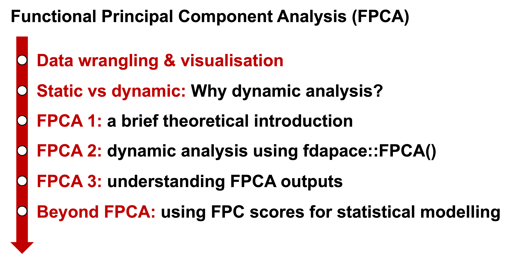

```{r include=FALSE}
library(rmdformats)
library(tidyverse)
library(kableExtra)  # For nice tables

# setting the plot theme globally
theme_set(theme_classic())

# define colour-blind-friendly colour palette 
cbPalette <- c("#000000", "#E69F00", "#56B4E9", "#009E73", "#F0E442", "#0072B2", "#D55E00", "#CC79A7")
```

# Functional Principal Component Analysis (FPCA)

In the previous section, we performed **principal component analysis (PCA)** on the static data -- i.e., the midpoint measurement of formant frequencies in the production of English /l/ and /ɹ/ by L1 Japanese and L1 English speakers. We have found that **F2** and **F3** seem to be the key in understanding their production judging from their contributions to the first principal component (PC1). 

Whereas we have identified **what parameters** would characterise the between-group difference, it does not tell us much about **how** the two speaker groups differ. More specifically, we now know that **F2** and **F3** are important to understand English /l/ and /ɹ/ productions better, our ultimate aim is to know **how** L1 Japanese speakers differ from L1 English speakers in producing English /l/ and /ɹ/. Let's turn to **dynamic analysis** and explore how the two groups of speakers differ in the realisations of **F2** and **F3** over time. 

We will use **Functional Principal Component Analysis (FPCA)** to explore salient dynamic properties in the data. The basic architecture is quite similar to the ordinary PCA that we have just seen with a couple of key differences as it deals with **functional** data. 

# FPCA: Roadmap

Here is the brief road map in the FPCA section:

```{r echo=FALSE, fig.align='center', out.width="75%"}


```

# Preliminaries

## Installing/loading packages

For the dynamic analysis using FPCA, we are using ```fdapace()``` package, so let's install it here.

```{r warning=FALSE, message=FALSE}
# installing packages
# install.packages("tidyverse")
# install.packages("fdapace")

# importing packages
library(tidyverse)
library(fdapace)
```

## Importing data set

Let's import the data set. We are using the data set openly available on the Open Science Framework (OSF) repository.

```{r message=FALSE}
# import the csv file "initial.liquid.dynamic.csv" from the "data" directory and save it as "df_dyn"
df_dyn <- readr::read_csv("data/initial.liquid.dynamic.csv")
```

# Check data

Similarly to the static analysis, let's spend some time inspecting the data set using ```colnames()```. 

```{r}
# Let's check what columns the data frame contains
colnames(df_dyn)
```

The majority of the variables in the data set are quite similar to the static data set. The dynamic data set also contains bark-normalised formant frequencies, but we won't be using them here. 

The crucial difference between the static and the dynamic data sets is the ```time``` column. As I explained earlier, the crucial aspect in the dynamic analysis is the ```time``` dimension, and we are interested in the time-varying characteristics in formant trajectories. 

Let's look into the ```time``` column in more detail. The following code displays what information is contained in the ```time``` column.

```{r}
df_dyn |> 
  dplyr::group_by(time) |> 
  dplyr::summarise() |> 
  dplyr::ungroup()
```

According to the code above, the ```time``` dimension contains numbers from 0 to 100 with an increment of 10. The data set expresses the time dimension **proportionally** from 0% to 100%. This means that the beginning of an interval corresponds to 0% time point, and then we get time points 10%, 20%, 30% etc as time goes by, until 100% that corresponds to the end of an interval. 

The next question here: what **interval** are we talking about? In the introduction section, I talked about the interaction between the liquid consonant and the following vowel. For this reason, we will treat the liquid and vowel intervals as one whole entity, in which each interval contains movement of the formant trajectories throughout the word-initial liquid and vowel intervals. This means that **0% time point corresponds to the onset of the word-initial liquid**, and **100% time point corresponds to the end point of the following vowel**.

# Data wrangling

## Omitting irrelavent columns

Let's tidy up the data a little bit to avoid further confusion. As done with the static anlaysis, we will try to remove columns that are no longer necessary. The three columns, ```IsApproximant```, ```IsAcoustic```, and ```omit``` can safely be removed, as well as some spectral measures including Bark-normalised and distance measures as they can be confusing later on. 

```{r}
# Let's check the number of "approximant" tokens
df_dyn |> 
  dplyr::group_by(IsApproximant) |> 
  dplyr::summarise() |> 
  dplyr::ungroup()

# Let's check the number of tokens of good recording quality
df_dyn |> 
  dplyr::group_by(IsAcoustic) |> 
  dplyr::summarise() |> 
  dplyr::ungroup()

# How about 'omit'?
df_dyn |> 
  dplyr::group_by(omit) |> 
  dplyr::summarise() |> 
  dplyr::ungroup()

# Remove columns that we no longer need
df_dyn <- df_dyn |> 
  dplyr::select(-c(IsApproximant, IsAcoustic, omit, Barkf1, Barkf2, Barkf3, Barkf2f1, Barkf3f2, f2f1, f3f2))
```
Let's check the column names again.

```{r}
colnames(df_dyn)
```

Note that we have a column called ```context```: this can be useful for grouping so let's keep them. But we can convert them into IPA symbols for a more intuitive representation:

```{r}
# convert the ARPABET notation into IPA symbols
df_dyn <- df_dyn |> 
  dplyr::mutate(
    context = case_when(
      context == "AE" ~ "/æ/",
      context == "IY" ~ "/i/",
      context == "UW" ~ "/u/"
    )
  )
```

## Checking the number of participants, tokens...

Let's also obtain some descriptive statistics here. Note that we need to divide the number of rows by 11 to obtain the accurate number of tokens, as one token now has 11 time points.

```{r}
# number of participants
df_dyn |> 
  dplyr::group_by(language) |> 
  dplyr::summarise(n = n_distinct(speaker)) |> 
  dplyr::ungroup()

# number of tokens per segment
df_dyn |> 
  dplyr::group_by(segment) |> 
  dplyr::summarise(n = n()/11) |> # divide by 11 time points
  dplyr::ungroup()
```

### Your turn

Similarly in the static analysis, please explore the data a little to understand the data better.

You can start with checking the column names to see what variables are available in the data set. Then, use ```dplyr::group_by()```, ```dplyr::summarise()``` and ```dplyr::ungroup()``` functions to inspect the data.

```{r}
# Check data further
# ...
```

# Data visualisation

## Scaling formant frequencies

Now, let's visualise the dynamic data. The basic procedure is the same as in the static analysis; We first apply z-score normalisation to the formant frequencies to make sure that formant values are comparable across speakers. 

```{r}
df_dyn <- df_dyn |> 
  dplyr::group_by(speaker) |> # tell R to do the following iteration per speaker
  dplyr::mutate(
    f1z = as.numeric(scale(f1)), # scale f1 into z-score
    f2z = as.numeric(scale(f2)), # scale f2 into z-score
    f3z = as.numeric(scale(f3)) # scale f3 into z-score
  ) |> 
  dplyr::ungroup() # don't forget ungrouping
```

## Descriptive statistics

Let's check the mean and SD for both raw and normalised formant values: just see F1 for now. Note that the mean z-scores do not seem to look zero, but this is because computers are not very good at dealing with very small numbers (e.g., decimals) and some fluctuations occur in computing the values.

```{r}
# check mean and sd of raw/scaled F1 values for each speaker
df_dyn |> 
  dplyr::group_by(speaker) |>
  dplyr::summarise(
    f1_mean = mean(f1),
    f1_sd = sd(f1),
    f1z_mean = mean(f1z),
    f1z_sd = sd(f1z)
  ) |> 
  dplyr::ungroup() 
```

### Your turn

Write a code chunk to inspect the mean and sd of raw/scaled F2 and F3 values for each **speaker** and for **speaker group**. Think how you group the data in ```dplyr::group_by()```.

```{r}
# check mean and sd of raw/scaled F2 values for each speaker group
# ...

# check mean and sd of raw/scaled F3 values for each speaker group
# ...
```

## Visualisation

### raw trajectories

In the PCA analysis, we combined scatter, violin and box plots to compare formant values extracted at liquid midpoint. Here, since we deal with **dynamic, time-varying** data, we need to slightly adjust our approach to data visualisation.

Dynamic analysis often involves the **time** dimension plotted on the x-axis and a variable of interest (e.g., ```f1z```) on the y-axis. This allows us to observe how the F2 values change over time. 

We will mainly use ```geom_point()``` and ```geom_path()``` to plot individual F2 trajectories. You can see ```group = file``` argument in the code below -- this is to instruct R to group multiple rows according to the grouping variable ```file```. 

```{r warning=FALSE}
# F1 - raw trajectories
df_dyn |> 
  ggplot(aes(x = time, y = f1z)) +
  geom_point(aes(colour = language, group = file), alpha = 0.4) +
  geom_path(aes(colour = language, group = file), linewidth = 0.3, alpha = 0.4) +
  geom_hline(yintercept = 0, linetype = "dashed", linewidth = 0.5) +
  scale_colour_manual(values = cbPalette) + 
  facet_grid(liquid ~ context) +
  labs(x = "time", y = "F1 (z-normalised)", title = "time-varying change in F1 frequency") +
  theme(strip.text.y = element_text(angle = 0))
```

### smooths

While I usually prefer just plotting raw trajectories because it is faithful to the nature of the data, I must admit that it is sometimes very difficult to see what's going on there. 

If you prefer, we could also just plot **smooths** to highlight the nonlinear between-group difference. The code below adds smoothed F1z trajectories to the raw data we just plotted (but I have commented out the raw trajectories for now). Note the difference in grouping; we used the ```file``` variable for the raw trajectories, but for smooths we need to use the ```language``` variable because we would like one smoothed trajectory for each L1 group. 

```{r warning=FALSE}
# F1 - smooths
df_dyn |> 
  ggplot(aes(x = time, y = f1z)) +
  # geom_point(aes(colour = language, group = file), width = 0.3, alpha = 0.1) +
  # geom_path(aes(colour = language, group = file), width = 0.3, alpha = 0.1) +
  geom_smooth(aes(colour = language, group = language), linewidth = 1.2, se = TRUE) +
  geom_hline(yintercept = 0, linetype = "dashed", linewidth = 0.5) +
  scale_colour_manual(values = cbPalette) + 
  facet_grid(liquid ~ context) +
  labs(x = "time", y = "F1 (z-normalised)", title = "smoothed time-varying change in F1 frequency") +
  theme(strip.text.y = element_text(angle = 0))
```

### Your turn

Please try writing a code chunk to visualise (1) raw and (2) smoothed trajectories for F2 and F3. You could try combining them both, too. Please feel free to explore your favourite colour schemes! 

```{r warning=FALSE}
# F2 - raw trajectory
# ...

# F2 - smooths
# ...

```


```{r warning=FALSE}
# F3 - raw trajectory
# ...

# F3 - smooths
# ...

```

# Why dynamic analysis?

I hope that you have enjoyed data visualisation! You'd know if you have tried plotting **F2**, but it seems that the F2 trajectories show very interesting between-group difference. 

This leads to a discussion as to **why we need to analyse dynamic data**, so let's spend a moment thinking about this. 

```{r warning=FALSE}
# F2
df_dyn |> 
  ggplot(aes(x = time, y = f2z)) +
  geom_point(aes(colour = language, group = file), width = 0.3, alpha = 0.1) +
  geom_path(aes(colour = language, group = file), width = 0.3, alpha = 0.1) +
  geom_smooth(aes(group = language), colour = "white", linewidth = 2.8, se = FALSE) +
  geom_smooth(aes(colour = language, group = language), linewidth = 1.8, se = TRUE) +
  geom_hline(yintercept = 0, linetype = "dashed", linewidth = 0.5) +
  scale_colour_manual(values = cbPalette) + 
  facet_grid(liquid ~ context) +
  labs(x = "time", y = "F2 (z-normalised)", title = "raw/smoothed time-varying change in F2 frequency") +
  theme(strip.text.y = element_text(angle = 0))
```

The dynamic data offers a new insight to the existing research findings: previous research has claimed that L1 Japanese speakers would make it **easier** to acquire the use of F2 in a target-like manner. But the dynamic data suggests that L1 Japanese speakers do something really different from L1 English speakers.

L1 English speakers follow somewhat consistent patterns across vowel contexts for both English /l/ and /ɹ/. They all start at a lower F2 at the beginning of the liquid onset (= 0%). The trajectories then go higher up to the maximal point in the middle of the interval (= around 50%). After reaching the highest peak, the trajectories go down towards the end of the interval (= 100%). Although there are some differences in terms of the timing that they achieve the maximal point, the overall patterns are fairly consistent. 

L1 Japanese speakers, on the other hand, show distinct trajectory patterns across vowel contexts. In the /æ/ context, both English /l/ and /ɹ/ trajectories show an almost monotonic, linear decrease from the liquid onset (= 0%) towards the vowel offset (= 100%). The trajectories in the /u/ context are also similar. In these two vowel contexts, the English /ɹ/ trajectories seem to mark the highest point at around 25% time point, but it is not as pronounced as that of L1 English speakers.

Their /i/ trajectories, on the other hand, show a similar pattern to that of L1 English speakers. They start at a lower F2 value at the liquid onset (= 0%), go higher up, and then show a slight decrease towards the end of the interval. The timing of the maximal point, however, is quite early (i.e., at around 40-45% time point) compared to L1 English speakers. 

### Your turn

Please compare and discuss the static and dynamic plots for F2. Could you discuss what static analysis possibly overlooks?

**Note**: The static analysis is based on the F2 measurement at the **liquid midpoint**. The dynamic analysis shows time-varying changes in F2 over **liquid-vowel** interval. 

```{r echo=FALSE, warning=FALSE, message=FALSE, fig.width=8, fig.height=8}
# load static data
load(file = "data/df_mid.rda")

# F2 static
f2_static <- df_mid |> 
  ggplot(aes(x = language, y = f2z)) +
  geom_jitter(aes(colour = language), width = 0.3, alpha = 0.4) +
  geom_violin(alpha = 0.4) +
  geom_boxplot(width = 0.4, alpha = 0.4) +
  geom_hline(yintercept = 0, linetype = "dashed", linewidth = 0.5) +
  scale_colour_manual(values = cbPalette) + 
  ylim(c(-4, 4)) +
  facet_grid(segment ~ vowel) +
  labs(x = "L1", y = "F2 (z-normalised)", title = "F2 liquid midpoint") +
  theme(strip.text.y = element_text(angle = 0))

# F2 dynamic
f2_dynamic <- df_dyn |> 
  ggplot(aes(x = time, y = f2z)) +
  geom_point(aes(colour = language, group = file), width = 0.3, alpha = 0.1) +
  geom_path(aes(colour = language, group = file), width = 0.3, alpha = 0.1) +
  geom_smooth(aes(group = language), colour = "white", linewidth = 2.8, se = FALSE) +
  geom_smooth(aes(colour = language, group = language), linewidth = 1.8, se = TRUE) +
  geom_hline(yintercept = 0, linetype = "dashed", linewidth = 0.5) +
  scale_colour_manual(values = cbPalette) + 
  facet_grid(liquid ~ context) +
  labs(x = "time", y = "F2 (z-normalised)", title = "F2 change over liquid-vowel interval") +
  theme(strip.text.y = element_text(angle = 0))

ggpubr::ggarrange(f2_static, f2_dynamic, ncol = 1)
```

# Functional Principal Component Analysis (FPCA)

## Introduction

In the static analysis using PCA, we have identified that **F2** and **F3** are the important spectral properties to better understand the L1/L2 production of English /l/ and /ɹ/. However, PCA did not show **how** the two groups differed in terms of the /l/ and /ɹ/ production. And the key to understanding the mechanisms underlying the between-group difference would be **dynamics**.

**Functional Principal Component Analysis (FPCA)** is the dynamic equivalent to the Principal Component Analysis (PCA). Similarly to PCA, FPCA is a dimentionality reduction technique that identify the salient variation in the data. However, there are some key differences: for instance, whereas FPCA takes **functions** as input as opposed to PCA based on individual data points. 

FPCA extracts **dominant patterns of variation from time-varying trajectories** and **expresses each curve as a weighted sum of principal components**. Each individual trajectory is represented by FPC scores, which quantify how much it follows each mode of variation. Basis functions help reconstruct smooth trajectories, with their coefficients adjusting to best capture variability in the data.

```{r message=FALSE, warning=FALSE, echo=FALSE}
# Create a table with key differences
comparison_table <- data.frame(
  Feature = c("Data Type", "Use Case", "Dimensionality Reduction", "Temporal Information", "Amount of Variance Explained", "Example in Phonetics"),
  PCA = c(
    "Fixed numerical values (e.g., F1/F2 at vowel midpoint)",
    "Analysing formant distributions at fixed points",
    "Finds static PCs that explain variance in a dataset",
    "Not preserved",
    "<b>Eigenvectors</b> of the covariance matrix, representing directions of maximal variance.",
    "Vowel space reduction using F1-F2"
  ),
  FPCA = c(
    "Continuous functions (e.g., F2 trajectory over time)",
    "Analysing time-dependent formant trajectories",
    "Finds dynamic PCs that explain how trajectories vary over time",
    "Fully preserved",
    "<b>Eigenfunctions</b> of the covariance operator, explaining the main modes of variation in the functional data",
    "Modeling liquid-vowel transitions in F2"
  )
)

# Display as a nice HTML table
kable(comparison_table, format = "html", escape = FALSE) %>%
  kable_styling("striped", full_width = F)
```


```{r message=FALSE, warning=FALSE, echo=FALSE, out.width="50%"}
# Load required packages
library(fda)       # Functional Data Analysis
library(ggplot2)   # Plotting
library(dplyr)     # Data manipulation
library(tidyr)     # Data reshaping

# Simulate an individual F2 contour (e.g., a vowel transition)
set.seed(123)
time_points <- seq(0, 1, length.out = 50)  # Normalized time (e.g., 0 = start, 1 = end)
F2_raw <- 1500 + 300 * sin(2 * pi * time_points) + rnorm(50, sd = 30)  # Add noise

# Define B-spline basis
nbasis <- 6  # Number of basis functions
bspline_basis <- create.bspline.basis(rangeval = c(0, 1), nbasis = nbasis)

# Convert raw data to a functional object
fd_data <- Data2fd(argvals = time_points, y = F2_raw, basisobj = bspline_basis)

# Extract fitted values for visualization
F2_smooth <- eval.fd(time_points, fd_data)

# Extract basis functions
basis_matrix <- eval.basis(time_points, bspline_basis)

# Convert data for ggplot
data_raw <- data.frame(time = time_points, F2 = F2_raw, Type = "Raw Data")
data_smooth <- data.frame(time = time_points, F2 = F2_smooth, Type = "Smoothed Curve")
data_basis <- data.frame(time = rep(time_points, nbasis), 
                         Basis = as.vector(basis_matrix),
                         Basis_ID = rep(1:nbasis, each = length(time_points)))

# Plot raw vs. smoothed F2 contour
ggplot() +
  geom_point(data = data_raw, aes(x = time, y = F2), color = "red", alpha = 0.4, size = 2) +
  geom_line(data = data_raw, aes(x = time, y = F2), color = "red", size = 0.8, alpha = 0.4, linetype = "dashed") +
  geom_line(data = data_smooth, aes(x = time, y = F2), color = "red", size = 1.2) +
  labs(title = "Smoothing an Individual Formant Contour with FPCA",
       x = "Time (Normalized)", y = "F2 (Hz)")

# Plot individual basis functions
ggplot(data_basis, aes(x = time, y = Basis, color = factor(Basis_ID))) +
  geom_line(size = 1.2) +
  labs(title = "B-Spline Basis Functions Used for Smoothing",
       x = "Time (Normalized)", y = "Basis Function Value",
       color = "Basis Function")
```

## FPCA using ```fdapace```

Let's try running FPCA here! Given that our previous PCA analysis suggested that **F2** is an important acoustic dimension, we'll try running FPCA on F2 to see what spectrotemporal dimensions are salient along the time-varying F2 trajectories.

Just to remind ourselves, here is what F2 trajectories look like in our data:

```{r echo=FALSE, message=FALSE, warning=FALSE}
# F2 raw and smoothed trajectories
df_dyn |> 
  ggplot(aes(x = time, y = f2z)) +
  geom_point(aes(colour = language, group = file), alpha = 0.4) +
  geom_path(aes(colour = language, group = file), linewidth = 0.3, alpha = 0.4) +
  geom_smooth(aes(colour = language, group = language), linewidth = 3.0, colour = "white", se = FALSE) +
  geom_smooth(aes(colour = language, group = language), linewidth = 2.0, se = TRUE) +
  geom_hline(yintercept = 0, linetype = "dashed", linewidth = 0.5) +
  scale_colour_manual(values = cbPalette) + 
  facet_grid(liquid ~ context) +
  labs(x = "time", y = "F2 (z-normalised)", title = "time-varying change in F2 frequency") +
  theme(strip.text.y = element_text(angle = 0))
```

We're using the ```fdapace``` package, which I think is a simple and easy approach to FPCA. Classic packages like ```fda``` can be more flexible but require lots of explicit coding. 

The FPCA workflow using ```fdapace``` is as follows:

1. FPCA using ```fdapace``` requires the input file to be arranged in a certain manner such that the time points (```tVec```) and the measurement values (```yVec```) are stored as lists for each trajectory (```ID```). The ```fdapace::MakeFPCAInputs()``` function can do this for us.

2. Check if the data structure is good for running FPCA via ```fdapace::CheckData()```. 

3. Run FPCA using ```fdapace::FPCA()``` specifying ```Ly``` and ```Lt``` arguments. 

```{r}
# IDs = token column; tVec = time column; yVec = variable column(s)
input_df <- fdapace::MakeFPCAInputs(IDs = df_dyn$file, tVec = df_dyn$time, yVec = df_dyn$f2z)

# Check if there's any issues with the data
fdapace::CheckData(input_df$Ly, input_df$Lt)

# No errors have been returned, so let's now run fPCA on the dynamic F2 trajectory
df_dyn_fpca <- fdapace::FPCA(Ly = input_df$Ly, Lt = input_df$Lt, optns = list(plot = TRUE))
```

## Checking fpca results

Let's look into the results here. We can first check the visualiastion summarising key information about the FPCA that we've just run. ```plot()``` is a base R function, but when we throw an FPCA object (i.e., the results of ```fdapace::FPCA()```), it shows:

- **Design Plot**: a graphical view of how your functional data is sampled over time, which helps assess the sampling strategy and the irregularity of data collection

- **Mean Function**: a visualisation of the **mean function** of all the trajectory data we've thrown into FPCA

- **Scree plot**: showing **the proportion of variance** explained by each FPC

- **First 3 Eigenfunctions**: the ''directions'' of the mode of variance identified along each FPC function. 

```{r}
plot(df_dyn_fpca)
```

```summary(df_dyn_fpca)``` tells you what attributes are stored in the FPCA data:

```{r}
summary(df_dyn_fpca)
```

Eigenvalues are stored in ```lambda```. Similarly in the ordinary PCA, this shows how much variance is explained by each FPCA. This case, FPC1 explains quite a lot of variance in the data, so we might only need to look at FPC1 to understand an overall trend in the F2 dynamics. 

```{r}
# eigenvalues
df_dyn_fpca$lambda
```

The cumulative proportion of variance is stored in ```cumFVE```. 

```{r}
# the cumulative percentage of variance explained by the eigenvalue
df_dyn_fpca$cumFVE
```

And as we did for the oridinary PCA, we can calculate ```cumFVE``` using eigenvalues (```lambda```). This manual approach differs slightly from the output shown with ```df_dyn_fpca$cumFVE``` reflecting slightly different calculation approaches, but you can see that the overall trend is still quite similar. 

```{r}
# calculating proportion of variance from eigenvalues
fpca_var_exp <- df_dyn_fpca$lambda / sum(df_dyn_fpca$lambda)

# compare this with cumFVE
fpca_var_exp

df_dyn_fpca$cumFVE
```

The dynamic analysis introduces the **time** dimension. ```df_dyn_fpca$workGrid``` gives you the time points at which data are sampled.

```{r}
# list of sampling time
df_dyn_fpca$workGrid
```

FPC scores are stored in ```df_dyn_fpca$xiEst```, expressing variability identified for each trajectory token along each **eigenfunction** (= functional principal components). Each row is 1 token, and each column corresponds to each FPC dimension.

```{r}
# FPC scores 
head(df_dyn_fpca$xiEst)

# eigenfunctions for reference
plot(df_dyn_fpca)
```
Finally, you can get a mean curve directly by applying ```GetMeanCurve``` and a scree plot with ```CreateScreePlot``` in the ```fdapace``` package. ```CreatePathPlot``` returns a plot showing individual trajectories. 

```{r}
# plot
plot(df_dyn_fpca)

# Mean curve
fdapace::GetMeanCurve(Ly = input_df$Ly, Lt = input_df$Lt, optns = list(plot = TRUE))

# scree plot
fdapace::CreateScreePlot(df_dyn_fpca)

# path plot
fdapace::CreatePathPlot(df_dyn_fpca, xlab = "normalised time", ylab = "F2 (z-normalised)")
```

## Understanding variation captured by FPCs

We have seen that our FPCA analysis identifies that FPC1 captures the majority of variation observed in the data. Let's check the details of this. The code below is from Strycharczuk et al. (2024) -- see the file "diphthongisation_paper.html" stored in the repository. 

The code below lets you visualise what variation is captured in FPC1 by adding and subtracting standard deviation to/from the mean curve along the variation captured by each eigenfunction.

```{r}
# function: get PC scores + return data frame with PCs for each token
get_pc_scores <- function(fpcaObj){
  pcs <- data.frame(fpcaObj$xiEst)
  token <- names(fpcaObj$inputData$Lt) 
  df <- cbind(token, pcs)
  n_pcs <- length(fpcaObj$lambda) # get number of PCs
  pc_names <- paste0("PC", 1:n_pcs) # create colnames for PCs
  names(df) <- c("file", pc_names) # add colnames for token + PCs
  return(df)
}

# get PC scores w/ token info
pc_df <- get_pc_scores(df_dyn_fpca)

# join PCs (dat) with selected cols from original data frame 
## store meta info
meta <- df_dyn |>  
  dplyr::select(speaker, gender, language, word, liquid, context, file)

## merge the list and meta data - unique(meta) because otherwise there would be lots of duplicates
dat <- left_join(pc_df, unique(meta), by = "file")

# function: define perturbation function (±Q = ±sd, k = PC number)
perturbation <- function(fpcaObj, Q, k){
  Q * sqrt(fpcaObj$lambda[k]) * fpcaObj$phi[,k] + fpcaObj$mu
}

# function: create perturbation object with mean and ±Q sd as a data frame (for one PC only)
# can validate against fdapace::GetMeanCurve and fdapace::CreateModeOfVarPlot
perturbation_object <- function(fpcaObj, Q, k){
  time <- fpcaObj$workGrid # grid of time values
  mean <- fpcaObj$mu # mean trajectory
  Qplus <- perturbation(fpcaObj, Q, k) # +Q sd
  Qminus <- perturbation(fpcaObj, -Q, k) # -Q sd
  df <- cbind(time, mean, Qplus, Qminus)
  colnames(df) <- c("time", "mean", "Qplus", "Qminus")
  df <- data.frame(df)
  df$PC <- paste0("PC", k) # add PC colname
  return(df)
}

# function: create perturbation data frame with mean and ±Q sd (for all PCs)
# to do: add ability to pass list of Q values for gradient perturbation function
get_perturbation <- function(fpcaObj, Q){
  n_pcs <- length(fpcaObj$lambda)
  k <- 1:n_pcs
  df <- lapply(k, perturbation_object, fpcaObj=fpcaObj, Q=Q)
  df <- dplyr::bind_rows(df) # unnest lists into single df
  return(df)
}

# get mean trajectory and ±2 sd for all PCs
Q <- seq(from = -2, to = 2, by = 0.1)
pQ <- lapply(Q, get_perturbation, fpcaObj = df_dyn_fpca)
names(pQ) <- Q # name pQ lists using value of Q
pQ <- dplyr::bind_rows(pQ, .id = "Q") # collapse lists together
pQ$Q <- as.numeric(pQ$Q) # make 'Q' column numeric

# visualise variation along each FPC with mean function
pQ <- pQ |> 
  dplyr::filter(PC %in% c('PC1','PC2', 'PC3', 'PC4')) |> 
  dplyr::mutate(
    PC = case_when(
      PC == "PC1" ~ "FPC1",
      PC == "PC2" ~ "FPC2",
      PC == "PC3" ~ "FPC3",
      PC == "PC4" ~ "FPC4"
    )
  ) |> 
  tidyr::pivot_longer(mean:Qminus, names_to = "Qsd", values_to = "value")

pQ |>
  ggplot2::ggplot() +
  aes(x = time, y = value, colour = Q, group = interaction(Q, Qsd)) +
  geom_path() +
  geom_line(data = pQ |>  dplyr::filter(Qsd == "mean"), aes(x = time, y = value), colour = "black", size = 1) + 
  facet_wrap(~ PC, ncol = 2) +
  scale_colour_gradient2(low = "#E69F00", mid = "#56B4E9", high = "#009E73", midpoint = 0)+
  labs(x = "Time (normalised)", y = "Reconstructed F2 values", color = "PC score")
```

Remember that FPC1 explains 79.23% of the variance in the data. FPC1 shows that the variation is larger towards the end of the interval, which seems to suggest that FPC1 captures the difference in the shape and height of F2 trajectories depending on the vowel context. FPC2, on the other hand, shows a greater variation closer to the onset of the interval, which might correspond to the difference between English /l/ and /ɹ/.

## Reconstructing F2 trajectories based on FPCs

We can reconstruct the F2 trajectories using the information captured by each FPC to better understand the dimension captured by FPC1.

### working out necessary parameters

Let's first work out parameters required for reconstructing the original PC1 trajectories. This includes: (1) mean curve, (2) time points used to fit FPCA, (3) eigenfunction associated with each time point and (4) PC loadings for each PC. These are stored in the ```fdapace::FDA``` object that we obtained from the FPCA analysis earlier. The following code computes eigenfunctions manually.

```{r}
# mean fPC1 trajectory
# pc1_mean_curve <- fdapace::GetMeanCurve(Ly = input.PC1$Ly, Lt = input.PC1$Lt, optns = list(plot = TRUE))
mu_values <- data.frame(df_dyn_fpca$mu) # mean curve values
mu_time <- data.frame(df_dyn_fpca$workGrid) # timepoints used for estimating the curve
phi <- data.frame(df_dyn_fpca$phi) # eigenfunction at each timepoint: workGrid * nlambda (e.g., 255 = 51 workGrid * 5 lambda)
lambda <- data.frame(df_dyn_fpca$lambda) # PC loadings for each PC: currently 5

# create a data frame containing mean curve, time and eigenfunctions assocaited with each PC at each time point
## add an extra column 'col_number' as a common index across the data frames - useful when merging everything together later on
### mean curve
mu_values <- mu_values |>  
  dplyr::mutate(
    col_number = row_number()
  )

### sampling time points
mu_time <- mu_time |>  
  dplyr::mutate(
    col_number = row_number()
  )

### eigenfunction
phi <- phi |>  
  dplyr::mutate(
    col_number = row_number()
  )

### pc loadings
lambda <- lambda |>  
  dplyr::mutate(
    PC = str_c("PC", row_number()),
    PC = str_c(PC, "lambda", sep = "_")
  ) |>  
  tidyr::pivot_wider(names_from = "PC", values_from = "df_dyn_fpca.lambda") |>  
  dplyr::slice(rep(1:n(), each = 51)) |>  
  dplyr::mutate(
    col_number = row_number()
  )
  
## merging all data together one by one
rec <- dplyr::left_join(mu_values, mu_time, by = "col_number")
rec <- dplyr::left_join(rec, phi, by = "col_number")
rec <- dplyr::left_join(rec, lambda, by = "col_number")

## tidying up some column names
rec <- rec |>  
  dplyr::select(col_number, df_dyn_fpca.workGrid, df_dyn_fpca.mu, X1, X2, X3, X4, PC1_lambda, PC2_lambda, PC3_lambda, PC4_lambda) |>  
  dplyr::rename(
    mean = df_dyn_fpca.mu,
    time = df_dyn_fpca.workGrid,
    PC1_eigen = X1,
    PC2_eigen = X2,
    PC3_eigen = X3,
    PC4_eigen = X4
  )

## plotting the eigenfunctions - this should match with a sub-plot in bottom right created with plot(PC1)
rec |>  
  ggplot() +
  # geom_path(aes(x = time, y = mean)) +
  geom_path(aes(x = time, y = PC1_eigen), colour = "black", linewidth = 1.5) +
  geom_path(aes(x = time, y = PC2_eigen), colour = "red", linetype = 2, linewidth = 1.5) +
  geom_path(aes(x = time, y = PC3_eigen), colour = "darkgreen", linetype = 3, linewidth = 1.5) +
  # geom_path(aes(x = time, y = value, colour = pc)) +
  geom_hline(yintercept = 0) +
  labs(x = "time", y = "eigenfunctions", title = "First 3 eigenfunctions")

## check if this matches plot(PC1)
plot(df_dyn_fpca)
```

OK, so we have managed to extract and reconstruct the three eigenfunctions from the data. Let's now merge the FPCA parameters with the meta data for a better handling. 

```{r}
# PC scores -> each row is 1 token, each column is one PC
head(df_dyn_fpca$xiEst)

# PC scores have already been added to the main data set
head(dat)

# duplicate each row by 51 times 
dat_time <- dat |> 
  dplyr::slice(rep(1:n(), each = 51))

# add col_names to merge with the other data frame
dat_time <- dat_time |>  
  dplyr::group_by(file) |>  
  dplyr::mutate(
    col_number = row_number()
  ) |>  
  ungroup()

# merge
dat_time <- left_join(dat_time, rec, by = "col_number")
```


### Reconstructed individual F2 trajectories based on FPC1

We have everything to reconstruct F2 trajectories from FPC scores: eigenfunctions, mean curve, and FPC scores. Let's reconstruct the individual F2 contours from FPC1 scores:

```{r warning=FALSE}
# reconstruct individual trajectory tokens
dat_time <- dat_time |>  
  dplyr::mutate(
    PC1_reconstruct = PC1 * PC1_eigen + mean,
    PC2_reconstruct = PC2 * PC2_eigen + mean,
    PC3_reconstruct = PC3 * PC3_eigen + mean,
    PC4_reconstruct = PC4 * PC4_eigen + mean
  )

# visualise FPC1
dat_time |>  
  ggplot() +
  geom_path(aes(x = time, y = PC1_reconstruct, group = file, colour = context), alpha = 0.2, show.legend = TRUE) +
  scale_color_manual(values = c("#000000", "#E69F00", "#56B4E9", "#009E73", "#F0E442", "#0072B2", "#D55E00", "#CC79A7")) +
  labs(x = "Proportional Time (%)", y = "F2", title = "Reconstructed F2 from FPC1") +
  geom_hline(yintercept = 0, linetype = 1, linewidth = 0.1) +
  guides(colour = guide_legend(override.aes = list(alpha = 1))) +
  facet_grid(liquid ~ language)
```

It is indeed true that FPC1 seems to capture variation associated with vowel context. The visualisation suggests that L1 English speakers have a smaller variation especially for English /ɹ/. It is also quite evident that L1 Japanese speakers do not seem to differentiate F2 trajectories between /æ/ and /u/, which is rather surprising. 


### Reconstructed individual F2 trajectories based on FPC2

What does F2 trajectory looks like when reconstructed from FPC2?

```{r warning=FALSE}
# visualise FPC2
dat_time |>  
  ggplot() +
  geom_path(aes(x = time, y = PC2_reconstruct, group = file, colour = context), alpha = 0.2, show.legend = TRUE) +
  scale_color_manual(values = c("#000000", "#E69F00", "#56B4E9", "#009E73", "#F0E442", "#0072B2", "#D55E00", "#CC79A7")) +
  labs(x = "Proportional Time (%)", y = "F2", title = "Reconstructed F2 from FPC2") +
  geom_hline(yintercept = 0, linetype = 1, linewidth = 0.1) +
  guides(colour = guide_legend(override.aes = list(alpha = 1))) +
  facet_grid(liquid ~ language)
```

OK, so there's something interesting here: we speculated earlier that FPC2 may be capturing the difference between English /l/ and /ɹ/, but it doesn't seem to be the case. Rather, FPC2 seems to capture **the degree of vocalic anticipatory coarticulation** that can be observed during the liquid interval. 


### Reconstructed individual F2 trajectories based on FPC1+FPC2

Finally, it is also possible to account for a joint contribution of FPC1 and FPC2 by summing the values together:

```{r warning=FALSE}
# reconstruct individual trajectory tokens
dat_time <- dat_time |>  
  dplyr::mutate(
    joint_PC1_PC2 = (PC1 * PC1_eigen) + (PC2 * PC2_eigen) + mean
  )

# visualise FPC1+FPC2
dat_time |>  
  ggplot() +
  geom_path(aes(x = time, y = joint_PC1_PC2, group = file, colour = context), alpha = 0.2, show.legend = TRUE) +
  scale_color_manual(values = c("#000000", "#E69F00", "#56B4E9", "#009E73", "#F0E442", "#0072B2", "#D55E00", "#CC79A7")) +
  labs(x = "Proportional Time (%)", y = "F2", title = "Reconstructed F2 from FPC1+FPC2") +
  geom_hline(yintercept = 0, linetype = 1, linewidth = 0.1) +
  guides(colour = guide_legend(override.aes = list(alpha = 1))) +
  facet_grid(liquid ~ language)
```

# Further statistical analysis

We have identified several key between-group spectrotemporal differences in the way English /l/ and /ɹ/ are produced. The FPC1 dimension suggests that:

- L1 Japanese speakers overall show a greater variability in F2 trajectories across vowel contexts along the FPC1 dimension than L1 English speakers, and 

- L1 Japanese speakers do not seem to distinguish the /æ/ and /u/ trajectories given the substantial overlap of trajectories. 

Remember that FPCA has converted each trajectory into numeric values (FPC scores) expressing the variation in trajectory shape: this means that **we can run a statistical model to predict FPC values based on a set of predictors**! 

## Data visualisation

Let's quickly check the distribution of FPC scores along the FPC1 dimension.

```{r}
# visualise
dat_time |> 
  # extract only one timepoint to avoid plotting duplicates
  dplyr::filter(time == "0") |> 
  ggplot(aes(x = context, y = PC1)) +
  geom_jitter(aes(colour = context), width = 0.3, alpha = 0.3) +
  geom_boxplot(width = 0.3) +
  geom_violin(alpha = 0.4) +
  geom_hline(yintercept = 0, linetype = "dashed", alpha = 0.3) +
  scale_colour_manual(values = cbPalette) +
  facet_grid(liquid ~ language) +
  theme(strip.text.y = element_text(angle = 0))
```

My favourite approach is to use **Bayesisn linear-mixed effect models** as this enables me to model the degree of overlap between FPC score distributions for each condition (as opposed to frequentist linear-mixed effect models that only provide point estimates). We won't discuss this further here, but the model could look like this:

```{r warning=FALSE, message=FALSE}
# load brms
library(brms)

# Run on multiple cores for Bayesian regressions
options(mc.cores = parallel::detectCores()) 

# convert variables into factor
dat_time$language <- as.factor(dat_time$language)
dat_time$context <- as.factor(dat_time$context)
dat_time$liquid <- as.factor(dat_time$liquid)
dat_time$speaker <- as.factor(dat_time$speaker)
dat_time$word <- as.factor(dat_time$word)

# specify prior
# b1_prior <- c(
#   brms::set_prior("normal(0, 10)", class = "Intercept"),
#   brms::set_prior("normal(0, 10)", class = "b"),
#   brms::set_prior("normal(0, 10)", class = "sd"),
#   brms::set_prior("normal(0, 10)", class = "sigma"),
#   brms::set_prior("lkj(2)", class = "cor"))

# full model
# m1 <- brms::brm(PC1 ~ language + context + liquid + language:context + context:liquid + language:liquid + (1 + context:liquid|speaker) + (1 + language|word), prior = b1_prior, data = dat_time, family = "gaussian", sample_prior = "yes", save_pars = save_pars(all = TRUE), save_model = TRUE)
```

# Save the data

As we did for PCA, let's save the data ```dat_time``` so that we can use it later.

```{r}
save(dat_time, file = "data/fpca_dat_time.rda")
```


# Wrap-up question

What hypothesis would you like to make to test the differences in dynamic F2 trajectories?

# Session Info

```{r}
sessionInfo()
```


# References

This FPCA section of the workshop materials is heavily drawn from the following resources (and the references cited therein):

Cronenberg, J., Gubian, M., Harrington, J. & Ruch, H. (2020): A dynamic model of the change from pre- to post-aspiration in Andalusian Spanish. *Journal of Phonetics, 83*, 101016. https://doi.org/10.1016/j.wocn.2020.101016

Gubian, M., Torreira, F., & Boves, L. (2015). Using Functional Data Analysis for investigating multidimensional dynamic phonetic contrasts. *Journal of Phonetics, 49*, 16–40. https://doi.org/10.1016/j.wocn.2014.10.001

Puggaard-Rode, R. (2023). The /t/ release in Jutland Danish. Decomposing the spectrum with functional PCA. In R. Skarnitzl & J. Volín. (Eds). *Proceedings of the International Congress of Phonetic Sciences* (pp. 3262–3266). Guarant International. Online supplementary materials: https://rpuggaardrode.github.io/icphs2023/

Ramsay, J. O., & Silverman, B. W. (2005). *Functional Data Analysis (Springer Series in Statistics)*. Springer New York. https://doi.org/10.1007/b98888

Ramsay, J., Hooker, G., & Graves, S. (2009). *Functional Data Analysis with R and MATLAB*. Springer New York. https://doi.org/10.1007/978-0-387-98185-7

Rickert, J. (2021). Functional PCA with R. Online tutorial. https://rviews.rstudio.com/2021/06/10/functional-pca-with-r/

Rickert, J. (2021). Exploratory Functional PCA with Sparse Data. Online tutorial. https://rviews.rstudio.com/2021/07/08/exploratory-fda-with-sparse-data/

Strycharczuk, P., Kirkham, S., Gorman, E., & Nagamine, T. (2024). Towards a dynamical model of English vowels. Evidence from diphthongisation. *Journal of Phonetics, 107*, 101349. https://doi.org/10.1016/j.wocn.2024.101349

Zhou, Y. et al. (2022). fdapace. Functional data analysis and empirical dynamics. Version 0.5.9  https://CRAN.R-project.org/package=fdapace.