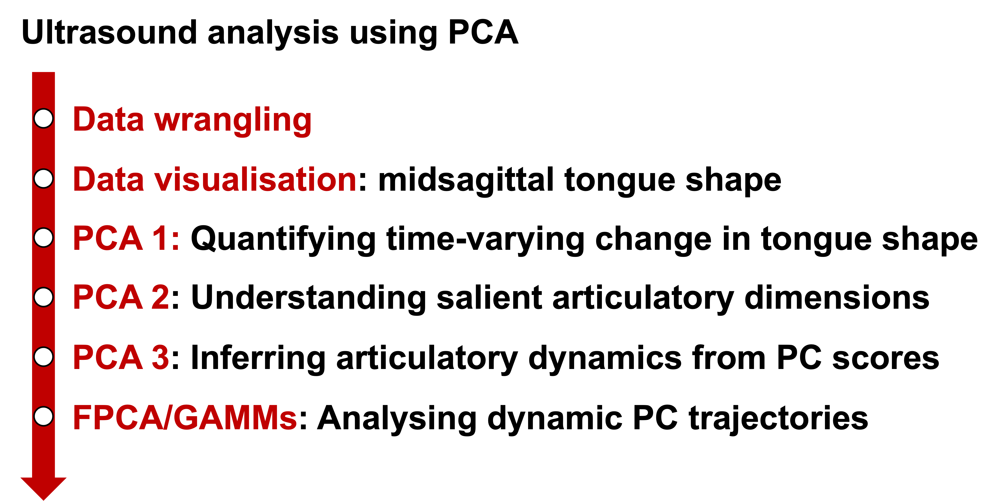

```{r include=FALSE}
library(rmdformats)
library(tidyverse)

# setting the plot theme globally
theme_set(theme_classic())

# define colour-blind-friendly colour palette 
cbPalette <- c("#000000", "#E69F00", "#56B4E9", "#009E73", "#F0E442", "#0072B2",
"#D55E00", "#CC79A7")
```


# PCA-based ultrasound data analysis: Roadmap

Here is the brief road map in the ultrasound data analysis:

```{r echo=FALSE, fig.align='center', out.width="75%"}


```

# Preliminaries

## Loading packages


```{r warning=FALSE, message = FALSE}
# data handling and visualisation
library(tidyverse)
library(lubridate)
library(ggpubr)

# FPCA + LMEs
library(fdapace)
library(lme4)
library(lmerTest)
library(emmeans)

# GAMMs
library(mgcv)
library(itsadug)
library(tidygam) # for 'get_gam_predictions'
source("https://raw.githubusercontent.com/soskuthy/gamm_intro/master/gamm_hacks.r")
```


## Loading data

The tongue spline data were exported from the AAA software and stored in the **spline** folder. The following code looks through the spline folder, read each .txt and append it to the earlier ones. 

```{r}
## loading data
# define the path
dir <- getwd()

# index wav files in the directory
file_list <- list.files(paste0(dir, "/ultrasound/spline"), pattern = ".txt", full.names = FALSE)

# create an empty list to store data
data_list <- list()

for(i in 1:length(file_list)){
  current_data <- read.delim(paste0(dir, "/ultrasound/spline/", file_list[i]), header = FALSE)
  
  data_list[[i]] <- current_data
}

# bind all data from the list into a data frame
dat <- bind_rows(data_list)

# omit na
dat <- na.omit(dat)
```

## Renaming columns

Let's rename the column names. It is assumed that you have exported tongue shape at **11 equidistant time points** throughout the interval. Also, the code here assumes that you have exported the following variables:

- Client name (Surname, First name, full name - whichever you prefer)
- Date and time of recording (not time within recording)
- Prompt
- Label (usually made on Praat TextGrid and then imported to AAA)
- X, Y values of spline DLC_Tongue (not *Tongue* - this is for XY values derived from older tongue surface tracking methods)

The DeepLabCut plug-in on AAA tracks midsagittal tongue splines based on 11 points along the tongue surface. This means that we will obtain 22 values - X/Y for point 1, X/Y for point 2, and so on. The code below specifies this with Point 1 at the vallecula (i.e., a little ‘valley’ formed by the roots of the tongue and the epiglottis) and moving forward as the number increases until Point No. 11 = tongue tip. For further information about the tracking points, please refer to the following paper:

Wrench, A., & Balch-Tomes, J. (2022). Beyond the Edge: Markerless Pose Estimation of Speech Articulators from Ultrasound and Camera Images Using DeepLabCut. *Sensors, 22*(3), Article 3. https://doi.org/10.3390/s22031133

```{r}
dat <- dat |> 
  janitor::remove_empty(which = "cols") |>  # remove empty columns
  dplyr::rename(
    speaker = V1, # speaker ID
    rec_date = V2, # date/time associated with each recording
    prompt = V3, # alias of prompt and repetition
    interval = V4 # textgrid label
    ) |> 
  dplyr::rename(
    X_1 = V5, # vallecula
    Y_1 = V6,
    X_2 = V7, # tongue root 1
    Y_2 = V8,
    X_3 = V9, # tongue root 2
    Y_3 = V10,
    X_4 = V11, # tongue body 1
    Y_4 = V12,
    X_5 = V13, # tongue body 2
    Y_5 = V14,
    X_6 = V15, # tongue dorsum 1
    Y_6 = V16,
    X_7 = V17, # tongue dorsum 2
    Y_7 = V18,
    X_8 = V19, # tongue blade 1
    Y_8 = V20,
    X_9 = V21, # tongue blade 2
    Y_9 = V22,
    X_10 = V23, # tongue tip 1
    Y_10 = V24,
    X_11 = V25, # tongue tip 2
    Y_11 = V26
  )

# eliminate one token that was not labelled properly
dat <- dat |> 
  filter(!str_detect(rec_date, "2022/11/29 17:48:39")
  )

# Specifying which time point of 11 each tongue spline is associated with. 
dat <- dat |> 
  group_by(rec_date, speaker) |> 
  mutate(prop_time = row_number() - 1) |>  # so that first row = 0
  ungroup() |> 
  mutate(prop_time = prop_time * 10) |>  # to give percentages
  mutate(prop_time = factor(prop_time)) |> 
  mutate(perc_time = paste(prop_time, "%", sep = "") |>  factor())

# Rename the prompt '18' into 'biribiri' as AAA wasn't able to handle the Japanese characters.
dat$prompt[dat$prompt == "18"] <- "biribiri"

# check data
dat
```

## Coverting into long format

Long format is easier to handle with tidyverse, so let's convert the data set here.

```{r}
## pivot longer: Use this when you work on the tongue only
dat_long <- dat |> 
  pivot_longer(5:26, names_to = c(".value", "point_number"), names_sep = "_")

# check 
dat_long
```

## Adding repetition

It is often the case that we have participants say each prompt multiple times. Personally, I find it easier to manage data using repetition when I need to omit some errorneous tokens - I usually make notes on when each participant makes an error while recording and filter them out later.

Although AAA does not export information on repetition (as far as I know), we can easily add repetition based on the date/time of recording.

```{r message=FALSE, warning=FALSE}
## 1. Getting R to recognise dates and time with the lubridate package
dat_long$rec_date <- lubridate::parse_date_time(dat_long$rec_date, c("Ymd HMS","dmY HM"))
# multiple formats are specified here because some rec_dates look weird when exported from AAA

## 2. create a summary of the data using summarise(), add repetition information (as it's easier) and store it in the object 'rep' 
rep <- dat_long |> 
  dplyr::group_by(speaker, prompt, rec_date) |> 
  dplyr::summarise() |> 
  dplyr::mutate(
    repetition = row_number()
  ) |> 
  ungroup()


## 3. merge 'rep' with the main data ('df.long' here) using 'left_join()'
dat_long <- dplyr::left_join(dat_long, rep, by = c("speaker", "prompt", "rec_date"))
```

Repetition is indeed useful here, as all recordings from the first attempt for the speaker ``2d57ke’’ need to be eliminated; I refit the probe and ultrasound headset to improve the quality of tongue imaging. When you move probe, you need to redo bite plane measurement because it changes the probe angle. So, let’s remove recordings from the speaker 2d57ke’s first attempt.

```{r}
dat_long <- dat_long |> 
  filter(!speaker == "2d57ke" | !repetition == "1")
```

## Creating tongue spline ID

In addition, although rec_date can act as a unique identifier for each token, I don’t particularly find it efficient to continue to use this. I usually create something called ```token ID``` by combining speaker, prompt and repetition.

In addition, when plotting tongue spline, you will need some grouping but this can sometimes be quite tedious. I find it useful to define a unique id for each tongue spline (i.e., a set of 22 data points - 11 points for each XY). Later on, you can group data by this ```spline ID``` to avoid ggplot from misunderstanding data structure. I combine ```token_id``` and ```proportion_time```.

```{r}
dat_long <- dat_long |> 
  dplyr::mutate(
    token_id = paste(speaker, prompt, sep = "_"),
    token_id = paste(token_id, repetition, sep = "_")
  )

### a combination of "rec_date" and "prop_time" gives unique label for each spline
dat_long <- dat_long |> 
  dplyr::mutate(
    spline_id = str_c(dat_long$token_id, dat_long$prop_time, sep = "_")
  )
```

## Z-score normalisation

Finally, let's scale each participant's tongue onto the z-score scale.

```{r}
## Z score normalisation of X Y coordinates
dat_long <- dat_long |> 
  dplyr::group_by(speaker) |> 
  dplyr::mutate(
    X_z = as.numeric(scale(X)),
    Y_z = as.numeric(scale(Y))
  ) |> 
  dplyr::ungroup()
```

# Data visualisation: tongue shape

The following code produces Figure 3 on my ICPhS paper. Note the grouping variables in the ```geom_path()``` function. 

```{r fig.width=10, fig.height=10}
# Converting the speaker ID into more straightforward naming convention
dat_long_plot <- dat_long |> 
  dplyr::filter(speaker %in% c("jcy8xi", "3bcpyh", "kjn9n4")) 

dat_long_plot$speaker[dat_long_plot$speaker == "jcy8xi"] <- "English A"
dat_long_plot$speaker[dat_long_plot$speaker == "3bcpyh"] <- "Japanese A"
dat_long_plot$speaker[dat_long_plot$speaker == "kjn9n4"] <- "Japanese B"

# Plotting the tongue splines
tongue_plot <- dat_long_plot |> 
  na.omit() |> 
  dplyr::group_by(speaker) |> 
  ggplot2::ggplot() +
  # grouping based on spline_id to get R to recognise that a tongue shapes consist of 11 DLC knots
  geom_point(aes(x = X_z, y = Y_z, group = spline_id, colour = as.numeric(prop_time))) +
  # geom_path(aes(x = X_z, y = Y_z, group = spline_id, colour = as.numeric(prop_time)), linewidth = 1, show.legend = TRUE) +
  geom_hline(yintercept = 0, linetype = 3) +
  theme_classic() +
  scale_colour_distiller(palette = "RdYlBu", guide = guide_colourbar(name = "Proportional time (%)", title.position = "top", title.hjust = 0.5)) +
  facet_grid(factor(speaker, levels = c("English A", "Japanese A", "Japanese B")) ~ prompt) +
  labs(x = "X", y = "Y", color='Proportional time (%)') +
  theme(plot.title = element_text(size = 20, hjust = 0.5, face = 'bold'),
        axis.text = element_text(size = 12),
        axis.title = element_text(size = 15),
        strip.text.x = element_text(size = 20),
        strip.text.y = element_text(size = 20),
        legend.text = element_text(size = 15),
        legend.position = "bottom",
        legend.title = element_text(size = 15, hjust = 0.5),
        legend.key.width = unit(2, "cm")
  )

# Showing the plot
tongue_plot
```

```{r}
# Plotting the tongue splines
tp_1 <- dat_long_plot |> 
  na.omit() |> 
  dplyr::group_by(speaker) |> 
  dplyr::filter(speaker == "English A",
                prompt == "bereave",
                repetition == "2",
                prop_time == "0") |> 
  ggplot2::ggplot() +
  # grouping based on spline_id to get R to recognise that a tongue shapes consist of 11 DLC knots
  # geom_point(aes(x = X_z, y = Y_z, group = spline_id, colour = as.numeric(prop_time))) +
  geom_path(aes(x = X_z, y = Y_z, group = spline_id), linewidth = 1, show.legend = TRUE) +
  geom_label(aes(x = X_z, y = Y_z, label = point_number), label.size = 0, size = 8, label.padding = unit(0, "lines")) +
  # geom_hline(yintercept = 0, linetype = 3) +
  theme_void() +
  # scale_colour_distiller(palette = "RdYlBu", guide = guide_colourbar(name = "Proportional time (%)", title.position = "top", title.hjust = 0.5)) +
  # facet_grid(factor(speaker, levels = c("English A", "Japanese A", "Japanese B")) ~ prompt) +
  labs(x = "X", y = "Y", color='Proportional time (%)')

# Showing the plot
tp_1

ggsave(tp_1, file = "/Users/takayukinagamine/Documents/github/SSF_2025/plot/tongue_example_1.png", width = 5, height = 5)

# Plotting the tongue splines
tp_2 <- dat_long_plot |> 
  na.omit() |> 
  dplyr::group_by(speaker) |> 
  dplyr::filter(speaker == "English A",
                prompt == "bereave",
                repetition == "2",
                prop_time == "30") |> 
  ggplot2::ggplot() +
  # grouping based on spline_id to get R to recognise that a tongue shapes consist of 11 DLC knots
  # geom_point(aes(x = X_z, y = Y_z, group = spline_id, colour = as.numeric(prop_time))) +
  geom_path(aes(x = X_z, y = Y_z, group = spline_id), linewidth = 1, show.legend = TRUE) +
  geom_label(aes(x = X_z, y = Y_z, label = point_number), label.size = 0, size = 8, label.padding = unit(0, "lines")) +
  # geom_hline(yintercept = 0, linetype = 3) +
  theme_void() +
  # scale_colour_distiller(palette = "RdYlBu", guide = guide_colourbar(name = "Proportional time (%)", title.position = "top", title.hjust = 0.5)) +
  # facet_grid(factor(speaker, levels = c("English A", "Japanese A", "Japanese B")) ~ prompt) +
  labs(x = "X", y = "Y", color='Proportional time (%)')

# Showing the plot
tp_2

ggsave(tp_2, file = "/Users/takayukinagamine/Documents/github/SSF_2025/plot/tongue_example_2.png", width = 5, height = 5)

# Plotting the tongue splines
tp_3 <- dat_long_plot |> 
  na.omit() |> 
  dplyr::group_by(speaker) |> 
  dplyr::filter(speaker == "English A",
                prompt == "bereave",
                repetition == "2",
                prop_time == "50") |> 
  ggplot2::ggplot() +
  # grouping based on spline_id to get R to recognise that a tongue shapes consist of 11 DLC knots
  # geom_point(aes(x = X_z, y = Y_z, group = spline_id, colour = as.numeric(prop_time))) +
  geom_path(aes(x = X_z, y = Y_z, group = spline_id), linewidth = 1, show.legend = TRUE) +
  geom_label(aes(x = X_z, y = Y_z, label = point_number), label.size = 0, size = 8, label.padding = unit(0, "lines")) +
  # geom_hline(yintercept = 0, linetype = 3) +
  theme_void() +
  # scale_colour_distiller(palette = "RdYlBu", guide = guide_colourbar(name = "Proportional time (%)", title.position = "top", title.hjust = 0.5)) +
  # facet_grid(factor(speaker, levels = c("English A", "Japanese A", "Japanese B")) ~ prompt) +
  labs(x = "X", y = "Y", color='Proportional time (%)')

# Showing the plot
tp_3

ggsave(tp_3, file = "/Users/takayukinagamine/Documents/github/SSF_2025/plot/tongue_example_3.png", width = 5, height = 5)

# Plotting the tongue splines
tp_4 <- dat_long_plot |> 
  na.omit() |> 
  dplyr::group_by(speaker) |> 
  dplyr::filter(speaker == "English A",
                prompt == "bereave",
                repetition == "2",
                prop_time == "80") |> 
  ggplot2::ggplot() +
  # grouping based on spline_id to get R to recognise that a tongue shapes consist of 11 DLC knots
  # geom_point(aes(x = X_z, y = Y_z, group = spline_id, colour = as.numeric(prop_time))) +
  geom_path(aes(x = X_z, y = Y_z, group = spline_id), linewidth = 1, show.legend = TRUE) +
  geom_label(aes(x = X_z, y = Y_z, label = point_number), label.size = 0, size = 8, label.padding = unit(0, "lines")) +
  # geom_hline(yintercept = 0, linetype = 3) +
  theme_void() +
  # scale_colour_distiller(palette = "RdYlBu", guide = guide_colourbar(name = "Proportional time (%)", title.position = "top", title.hjust = 0.5)) +
  # facet_grid(factor(speaker, levels = c("English A", "Japanese A", "Japanese B")) ~ prompt) +
  labs(x = "X", y = "Y", color='Proportional time (%)')

# Showing the plot
tp_4

ggsave(tp_4, file = "/Users/takayukinagamine/Documents/github/SSF_2025/plot/tongue_example_4.png", width = 5, height = 5)

# Plotting the tongue splines
tp_5 <- dat_long_plot |> 
  na.omit() |> 
  dplyr::group_by(speaker) |> 
  dplyr::filter(speaker == "English A",
                prompt == "bereave",
                repetition == "2",
                prop_time == "100") |> 
  ggplot2::ggplot() +
  # grouping based on spline_id to get R to recognise that a tongue shapes consist of 11 DLC knots
  # geom_point(aes(x = X_z, y = Y_z, group = spline_id, colour = as.numeric(prop_time))) +
  geom_path(aes(x = X_z, y = Y_z, group = spline_id), linewidth = 1, show.legend = TRUE) +
  geom_label(aes(x = X_z, y = Y_z, label = point_number), label.size = 0, size = 8, label.padding = unit(0, "lines")) +
  # geom_hline(yintercept = 0, linetype = 3) +
  theme_void() +
  # scale_colour_distiller(palette = "RdYlBu", guide = guide_colourbar(name = "Proportional time (%)", title.position = "top", title.hjust = 0.5)) +
  # facet_grid(factor(speaker, levels = c("English A", "Japanese A", "Japanese B")) ~ prompt) +
  labs(x = "X", y = "Y", color='Proportional time (%)')

# Showing the plot
tp_5

ggsave(tp_5, file = "/Users/takayukinagamine/Documents/github/SSF_2025/plot/tongue_example_5.png", width = 5, height = 5)

# Plotting the tongue splines
tp_6 <- dat_long_plot |> 
  na.omit() |> 
  dplyr::group_by(speaker) |> 
  dplyr::filter(speaker == "English A",
                prompt == "bereave",
                repetition == "2",
                prop_time == "100") |> 
  ggplot2::ggplot() +
  # grouping based on spline_id to get R to recognise that a tongue shapes consist of 11 DLC knots
  # geom_point(aes(x = X_z, y = Y_z, group = spline_id, colour = as.numeric(prop_time))) +
  geom_path(aes(x = X_z, y = Y_z, group = spline_id), linewidth = 5, show.legend = TRUE) +
  # geom_label(aes(x = X_z, y = Y_z, label = point_number), label.size = 0, size = 8, label.padding = unit(0, "lines")) +
  # geom_hline(yintercept = 0, linetype = 3) +
  theme_void() +
  # scale_colour_distiller(palette = "RdYlBu", guide = guide_colourbar(name = "Proportional time (%)", title.position = "top", title.hjust = 0.5)) +
  # facet_grid(factor(speaker, levels = c("English A", "Japanese A", "Japanese B")) ~ prompt) +
  labs(x = "X", y = "Y", color='Proportional time (%)')

# Showing the plot
tp_6

ggsave(tp_6, file = "/Users/takayukinagamine/Documents/github/SSF_2025/plot/tongue_example_6.png", width = 5, height = 3.5)
```


# Principal Component Analysis (PCA) on midsagittal tongue shape

While the visual inspection makes it fairly obvious that there are some articulatory differences between English and Japanese speakers, a challenging aspect in ultrasound data analysis to quantify such differences. 

One way of quantification is through **principal component analysis (PCA)**. PCA here identifies the key modes of variation in the 11 DLC knots, and by projecting PCs back onto the original scale, we can infer the salient articulatory dimensions observed in the data. 

This approach is explained in the following book:

Johnson, K. (2008). *Quantitative Methods In Linguistics*. Chichester, England: Wiley-Blackwell.

See particularly: Chapter 3 Phonetics (Section 3.3 Tongue Shape Factors: Principal Component Analysis, pp. 95-102).

## Running PCA using ```prcomp()```

Let's run PCA onto the x/y coordinates for 11 DLC knots. I try using the ```prcomp()``` function here to be consistent with our approach in the workshop, as opposed to the ```princomp()``` function originally used in my ICPhS paper.

The PCA analysis below suggests that PC1 captures 58.03% of the variance observed in the data, followed by PC2 (22.65%) and PC3 (7.66%). This suggests that both ```prcomp()``` and ```princomp()``` outputs very similar results. 

```{r}
# perform PCA
pca_results <- prcomp(dplyr::select(dat, 5:26), scale = TRUE)

# summary
summary(pca_results)
```

## Understanding data

### Scree plot

Here let's inspect the data. As a rule of thumb, we can use a 5% threshold of the proportion of variance as recommended by Bayeen (2008). The scree plot just visualises the proportion of variance explained by each PC that we just saw using ```summary()```.

```{r}
# Plotting the variance explained
var_explained <- pca_results$sdev^2 / sum(pca_results$sdev^2)

# making var_explained as a tibble and add colname
var_explained <- tidyr::as_tibble(var_explained)

# adding PC number
var_explained <- var_explained |> 
  tidyr::as_tibble() |> 
  dplyr::mutate(
    PC = row_number()
  )

# only plot PC10 or below 
var_explained <- var_explained |> 
  dplyr::filter(PC < 11) 

# create scree plot
scree <- var_explained |> 
  ggplot(mapping = aes(x = PC, y = value)) +
  geom_line() +
  geom_point(data = subset(var_explained)) +
  geom_text(data = subset(var_explained, PC < 4), aes(label = round(value, digits = 5)), nudge_x = 0.8) +
  geom_label(data = subset(var_explained, PC < 4), aes(label = PC), label.padding = unit(0.40, "lines")) +
  geom_hline(yintercept = 0.05, linetype = 'dotted') +
  xlab("Principal Component") +
  ylab("Variance Explained") +
  ggtitle("Proportion of Variance explained by each PC") +
  ylim(0, 0.6)

# show plot
scree
```

# Projecting PCs back onto midsagittal tongue shape

OK, now the question is what articulatory movement is captured by each PC. As explained in Johnson (2008, p. 100), it is possible to project PC dimensions back on the original scale. In our case, we can reconstruct the *i*-th data point along the tongue surface (e.g., DLC knot 1, 2, 3 etc in our case) and, by extension, visualise the tongue shape at one particular time point decomposed by each PC using the following formula:

$$
x_{ji} = \bar{x}_i ± s_j * w_{ji} 
$$

where $\bar{x}$ denotes the mean, *s* means standard deviation (SD) and *w* denotes the PC loading for the $PC_j$ dimension.  

This means that we'll need to extract (1) mean PC scores, (2) standard deviation and (3) PC loadings from the PCA results. 

## Extracting mean and loadings

The mean values are stored in ```pca_results$center```, and the loadings in ```pca_results$rotation```. In order to better understand the structure of a data object, it is useful to inspect it using ```str()```.

```{r}
# Check the object structure
str(pca_results)

# Mean values from the output of the PCA
pca_mean <- tibble::enframe(pca_results$center)

# subset data to make into a matrix of x and y values
pca_mean <- pca_mean |> 
  dplyr::mutate(
    axis_mean = str_sub(name, start = 1, end = 1),
    number_mean = str_sub(name, start = 3, end = -1)
  ) |> 
  dplyr::select(-name) |> 
  dplyr::relocate(axis_mean, number_mean)

# extract X coordinate values of the mean values
mean_X <- pca_mean |> 
  dplyr::filter(axis_mean == "X") |> 
  dplyr::rename(mean_X = value,
                axis_mean_X = axis_mean,
                number_mean_X = number_mean)

# extract Y coordinate values of the mean values
mean_Y <- pca_mean |> 
  dplyr::filter(axis_mean == "Y") |> 
  dplyr::rename(mean_Y = value,
                axis_mean_Y = axis_mean,
                number_mean_Y = number_mean)

# combine X and Y values together
mean_pca <- cbind(mean_X, mean_Y)

# get loadings: calculate from eigenvectors (obtained from pca_results$rotation)
## loadings = eigenvectors * sqrt(eigenvalues)
## sqrt(eigenvalues) = standard deviation
loadings <- pca_results$rotation %*% diag(pca_results$sdev)
```

## Loadings

Let's only extract PC loadings that are relevant here. We'll focus only on PC1 and PC2 as they jointly account for the majority of variance observed in the data (80.68%) and they should be adequate for us to understand the overall articulatory patterns. 

### PC1

Here is the code to gather necessary information for PC1.

```{r}
# get loadings for PC1 in a sensible format
PC1_loadings <- as.data.frame(loadings) |> 
  dplyr::select(V1)

# rename the first column (which wasn't a column really)
## manually convert the first column into a proper column
PC1_loadings <- data.frame(Label = rownames(PC1_loadings), PC1_loadings, row.names = NULL)
## rename
colnames(PC1_loadings)[1] <- "DLC_knot" 

# separate axis and number for each DLC knot 
PC1_loadings <- PC1_loadings |> 
  dplyr::mutate(
    axis_loadings = str_sub(DLC_knot, start = 1, end = 1),
    number_loadings = str_sub(DLC_knot, start = 3, end = -1)
  )

## separating X coordinates
PC1_loadings_X <- PC1_loadings |> 
  dplyr::filter(axis_loadings == "X") |> 
  dplyr::select(-DLC_knot) |> 
  dplyr::relocate(axis_loadings, number_loadings) |> 
  # raname variables -- we'll combine everything later but R doesn't allow multiple columns to have identical names
  dplyr::rename(PC1_loadings_X = V1,
                axis_loadings_X = axis_loadings,
                number_loadings_X = number_loadings)

## separating Y coordinates
PC1_loadings_Y <- PC1_loadings |> 
  dplyr::filter(axis_loadings == "Y") |> 
  dplyr::select(-DLC_knot) |> 
  dplyr::relocate(axis_loadings, number_loadings) |> 
  # raname variables -- we'll combine everything later but R doesn't allow multiple columns to have identical names
  dplyr::rename(PC1_loadings_Y = V1,
                # PC1_loadings_X = Freq,
                axis_loadings_Y = axis_loadings,
                number_loadings_Y = number_loadings)

## bind the X and Y data frames together
PC1_loadings <- cbind(PC1_loadings_X, PC1_loadings_Y)
```

### PC2

The same for PC2.

```{r}
# get loadings for PC2 in a sensible format
PC2_loadings <- as.data.frame(loadings) |> 
  dplyr::select(V2)

# rename the first column (which wasn't a column really)
## manually convert the first column into a proper column
PC2_loadings <- data.frame(Label = rownames(PC2_loadings), PC2_loadings, row.names = NULL)
## rename
colnames(PC2_loadings)[1] <- "DLC_knot" 

# separate axis and number for each DLC knot 
PC2_loadings <- PC2_loadings |> 
  dplyr::mutate(
    axis_loadings = str_sub(DLC_knot, start = 1, end = 1),
    number_loadings = str_sub(DLC_knot, start = 3, end = -1)
  )

## separating X coordinates
PC2_loadings_X <- PC2_loadings |> 
  dplyr::filter(axis_loadings == "X") |> 
  dplyr::select(-DLC_knot) |> 
  dplyr::relocate(axis_loadings, number_loadings) |> 
  # raname variables -- we'll combine everything later but R doesn't allow multiple columns to have identical names
  dplyr::rename(PC2_loadings_X = V2,
                axis_loadings_X = axis_loadings,
                number_loadings_X = number_loadings)

## separating Y coordinates
PC2_loadings_Y <- PC2_loadings |> 
  dplyr::filter(axis_loadings == "Y") |> 
  dplyr::select(-DLC_knot) |> 
  dplyr::relocate(axis_loadings, number_loadings) |> 
  # raname variables -- we'll combine everything later but R doesn't allow multiple columns to have identical names
  dplyr::rename(PC2_loadings_Y = V2,
                # PC2_loadings_X = Freq,
                axis_loadings_Y = axis_loadings,
                number_loadings_Y = number_loadings)

## bind the X and Y data frames together
PC2_loadings <- cbind(PC2_loadings_X, PC2_loadings_Y)
```

## Standard deviation

We also need standard deviation associated with each PC. This is stored in ```pca_results$sdev```.

```{r}
# get sds of first 2 PCs
sd <- tibble::enframe(pca_results$sdev)
sd_PC1 <- as.numeric(sd[1,2])
sd_PC2 <- as.numeric(sd[2,2])
```

## Calculating **max** and **min** values

The data visualisation will show the each PC dimensions by adding and subtracting the **variations** (i.e., $SD * loadings$) to/from the **mean** tongue shape, as per Johnson's (2008) formula. The following code calculates these for X and Y coordinates separately. 

```{r}
# calculate estimated values including sd
## PC1
estimate_PC1 <- cbind(mean_pca, PC1_loadings)
estimate_PC1$PC1_max_X <- estimate_PC1$mean_X + sd_PC1*estimate_PC1$PC1_loadings_X
estimate_PC1$PC1_min_X <- estimate_PC1$mean_X - sd_PC1*estimate_PC1$PC1_loadings_X
estimate_PC1$PC1_max_Y <- estimate_PC1$mean_Y + sd_PC1*estimate_PC1$PC1_loadings_Y
estimate_PC1$PC1_min_Y <- estimate_PC1$mean_Y - sd_PC1*estimate_PC1$PC1_loadings_Y

# calculate estimated values including sd
## PC2
estimate_PC2 <- cbind(mean_pca, PC2_loadings)
estimate_PC2$PC2_max_X <- estimate_PC2$mean_X + sd_PC2*estimate_PC2$PC2_loadings_X
estimate_PC2$PC2_min_X <- estimate_PC2$mean_X - sd_PC2*estimate_PC2$PC2_loadings_X
estimate_PC2$PC2_max_Y <- estimate_PC2$mean_Y + sd_PC2*estimate_PC2$PC2_loadings_Y
estimate_PC2$PC2_min_Y <- estimate_PC2$mean_Y - sd_PC2*estimate_PC2$PC2_loadings_Y
```

## Data visualisation

Now we are all set! Let's visualise the tongue shape to inspect what articulatory dimensions are captured by each PC. 

```{r  fig.width=10, fig.height=5, message=FALSE, warning=FALSE}
# PC1
PC1_reconstructed <- ggplot() +
  geom_line(data = estimate_PC1, aes(x = mean_X, y = mean_Y), size = 1.5) +
  geom_line(data = estimate_PC1, aes(x = PC1_max_X, y = PC1_max_Y), linetype = "dashed", linewidth = 1, alpha = 0.5, colour = "#E69F00") +
  geom_line(data = estimate_PC1, aes(x = PC1_min_X, y = PC1_min_Y), linetype = "dotted", linewidth = 1, alpha = 0.5, colour = "#56B4E9") +
  geom_point(data = estimate_PC1, aes(x = PC1_max_X, y = PC1_max_Y), shape = 3, size = 3, stroke = 2, colour = "#E69F00") +
  geom_point(data = estimate_PC1, aes(x = PC1_min_X, y = PC1_min_Y), shape = "\u2212", size = 5, stroke = 8, colour = "#56B4E9") +
  labs(x = "X", y = "Y", title = "PC1")

# PC2
PC2_reconstructed <- ggplot() +
  geom_line(data = estimate_PC2, aes(x = mean_X, y = mean_Y), size = 1.5) +
  geom_line(data = estimate_PC2, aes(x = PC2_max_X, y = PC2_max_Y), linetype = "dashed", linewidth = 1, alpha = 0.5, colour = "#E69F00") +
  geom_line(data = estimate_PC2, aes(x = PC2_min_X, y = PC2_min_Y), linetype = "dotted", linewidth = 1, alpha = 0.5, colour = "#56B4E9") +
  geom_point(data = estimate_PC2, aes(x = PC2_max_X, y = PC2_max_Y), shape = 3, size = 3, stroke = 2, colour = "#E69F00") +
  geom_point(data = estimate_PC2, aes(x = PC2_min_X, y = PC2_min_Y), shape = "\u2212", size = 5, stroke = 8, colour = "#56B4E9") +
  labs(x = "X", y = "Y", title = "PC2")

# showing plots
ggpubr::ggarrange(PC1_reconstructed, PC2_reconstructed, nrow = 1)
```

So, this is quite similar to Figure 1 of the ICPhS paper: PC1 captures **front-back** movement of the tongue, in which **larger** PC1 values indicate more tongue **fronting**. PC2 captures **high-low** dimension, in which **smaller** PC2 values indicate **higher** tongue shape. 

# Dynamic changes in PC scores

Since the input to the PCA analysis here involves temporal information (i.e., tongue shapes extracted at 11 temporal points during the vowel-liquid-vowel interval), it is possible to infer **dynamic changes in tongue shape** for each production token. We can do so by **tracking changes in PC scores for each PC dimension**. 

## Extracting PC scores

Let's extract PC scores associated with the PC1 and PC2 dimensions. PC scores are stored in ```pca_results$x```.

```{r}
# Check the attributes again
str(pca_results)

# Get the results of the PCA which are useful
pc_score <- pca_results$x

# Put it into a sensible format as some variables come out weird
pc_score <- as_tibble(pc_score) |> 
  dplyr::select(1:4)

# Combine with non-numeric information from earlier
dat_pc <- cbind(dat, pc_score)

# normalise PCs by speaker for comparison
pca_result <- dat_pc |> 
  dplyr::group_by(speaker) |>  
  dplyr::mutate(
    PC1z = scale(PC1),
    PC2z = scale(PC2),
    PC3z = scale(PC3),
    PC4z = scale(PC4)
  ) |> 
  dplyr::ungroup()
```

## Data wrangling

We'll transform the data into a long format so that we'll be able to handle it better for data visualisation using ```ggplot2```.

```{r}
# converting data frame into long format (and parsing rec_date)
pca_result_long <- pca_result |> 
  tidyr::pivot_longer(5:26, names_to = c(".value", "point_number"), names_sep = "_") |> 
  dplyr::mutate(
    rec_date = lubridate::parse_date_time(rec_date, c("Ymd HMS","dmY HM"))
  )

# integrate meta data by joining pca_result_long to dat_long
dat_long <- dplyr::left_join(dat_long, pca_result_long, by = c("speaker", "rec_date", "prompt", "interval", "prop_time", "perc_time", "point_number", "X", "Y"))

# add L1 information
dat_long <- dat_long |> 
  dplyr::mutate(
    L1 = case_when(
      speaker %in% c("4ps8zx", "5jzj2h", "5upwe3", "6p63jy", "cu2jce", "ds6umh", "h5s4x3", "jcy8xi", "m46dhf", "tay55n", "we8z58", "xub9bc") ~ "English",
      TRUE ~ "Japanese"
    )
  )
```

## Data visualisation

Let's visualise dynamic changes in PC scores. This is similar to Figures 2 but I've added raw trajectories as well. 

To make the interpretation of PC2 more intuitive, I have flipped the symbol of the PC2z scores so that the positive PC2 values indicate tongue raising.

### PC1 (front-back)

```{r warning=FALSE, message=FALSE}
# PC1
dat_long |> 
  ggplot(aes(x = prop_time, y = PC1z)) +
  geom_line(aes(group = token_id, colour = prompt), alpha = 0.4) +
  geom_smooth(aes(group = prompt), colour = "white", linewidth = 3.0, alpha = 0.4) +
  geom_smooth(aes(group = prompt, colour = prompt), linewidth = 1.5, alpha = 0.4) +
  geom_hline(yintercept = 0, linetype = "dashed", linewidth = 1, alpha = 0.4) +
  annotate("text", x = 1.5, y = -3, label = "← Retraction", hjust = 1, vjust = 0, size = 3, angle = 90, fontface = "bold") +
  annotate("text", x = 1.5, y = 4, label = "Fronting →", hjust = 1, vjust = 0, size = 3, angle = 90, fontface = "bold") +
  scale_colour_manual(values = cbPalette) +
  labs(x = "Proportional time (%)", y = "PC1 (z-normalised)", title = "Dynamic changes in PC1") +
  facet_wrap(~ L1)
```

### PC2 (high-low)

```{r warning=FALSE, message=FALSE}
# PC2
dat_long |> 
  # note the symbol inversion for PC2z
  ggplot(aes(x = prop_time, y = -PC2z)) +
  geom_line(aes(group = token_id, colour = prompt), alpha = 0.4) +
  geom_smooth(aes(group = prompt), colour = "white", linewidth = 3.0, alpha = 0.4) +
  geom_smooth(aes(group = prompt, colour = prompt), linewidth = 1.5, alpha = 0.4) +
  annotate("text", x = 1.5, y = -1.5, label = "← Lowering", hjust = 1, vjust = 0, size = 3, angle = 90, fontface = "bold") +
  annotate("text", x = 1.5, y = 3, label = "Raising →", hjust = 1, vjust = 0, size = 3, angle = 90, fontface = "bold") +
  geom_hline(yintercept = 0, linetype = "dashed", linewidth = 1, alpha = 0.4) +
  scale_colour_manual(values = cbPalette) +
  labs(x = "Proportional time (%)", y = "PC2 (z-normalised; inverted)", title = "Dynamic changes in PC2 (inverted)") +
  facet_wrap(~ L1)
```

# Statistical analysis

My ICPhS paper didn't go beyond data visualisation. But we tried both FPCA and GAMMs in the statistics workshop this week, so why don't we try them? I'll try running stats on PC1. 

The PCA analysis above compresses the movement of 11 DLC knots into one PC score for a tongue contour at each time point along each PC dimension. This means that we won't need to keep the original data structure anymore, and this will cause some errors when running non-linear stats. So let's subset the data set so that each row corresponds to one PC score at one time point. 

```{r warning=FALSE, message=FALSE}
dat_sub <- dat_long |> 
  dplyr::group_by(speaker, L1, rec_date, prompt, interval, prop_time, repetition, token_id) |> 
  # taking mean() but this shouldn't change the values because PC values are the same for all 11 DLC knots
  dplyr::summarise(PC1z = mean(PC1z),
                   PC2z = mean(PC2z)) |> 
  dplyr::ungroup()
```

We'll also convert ```prop_time``` into numeric values.

```{r}
dat_sub$prop_time <- as.numeric(dat_sub$prop_time)
```


Even the subset data frame should enable the same data visualisation -- just as a sanity check:

```{r}
dat_sub |> 
  ggplot(aes(x = prop_time, y = PC1z)) +
  geom_line(aes(group = token_id, colour = prompt), alpha = 0.4) +
  geom_smooth(aes(group = prompt), colour = "white", linewidth = 3.0, alpha = 0.4) +
  geom_smooth(aes(group = prompt, colour = prompt), linewidth = 1.5, alpha = 0.4) +
  geom_hline(yintercept = 0, linetype = "dashed", linewidth = 1, alpha = 0.4) +
  annotate("text", x = 1.5, y = -3, label = "← Retraction", hjust = 1, vjust = 0, size = 3, angle = 90, fontface = "bold") +
  annotate("text", x = 1.5, y = 4, label = "Fronting →", hjust = 1, vjust = 0, size = 3, angle = 90, fontface = "bold") +
  scale_colour_manual(values = cbPalette) +
  labs(x = "Proportional time (%)", y = "PC1 (z-normalised)", title = "Dynamic changes in PC1") +
  facet_wrap(~ L1)
```

Looks good, let's move onto FPCA!

# FPCA

## Creating FPCA input and run FPCA

As we saw earlier in the workshop, we first create FPCA input using ```fdapace::MakeFPCAInputs()```, and then check if the input has an appropriate structure using ```fdapace::CheckData()```. The checking process would spit errors if ```prop_time``` wasn't numeric.

```{r}
# IDs = token column; tVec = time column; yVec = variable column(s)
input_dat <- fdapace::MakeFPCAInputs(IDs = dat_sub$token_id, tVec = dat_sub$prop_time, yVec = dat_sub$PC1z)

# Check if there's any issues with the data
fdapace::CheckData(input_dat$Ly, input_dat$Lt)

# No errors have been returned, so let's now run FPCA 
dat_dyn_fpca <- fdapace::FPCA(Ly = input_dat$Ly, Lt = input_dat$Lt, optns = list(plot = TRUE))
```
The mean function seems to capture the overall pattern, in which tongue achieves maximal retraction earlier in the interval and then shows fronting towards the vowel /i/. 

Let's quickly check what proportion of variance is captured by each FPC.

```{r}
dat_dyn_fpca$cumFVE
```

FPC1 captures 52.74% of variance observed in the PC1 trajectories and FPC2 27.58% and FPC3 14.26%. The first three FPCs jointly explain 94.31% of variance. 

## Understanding FPCs

We'll skip the intermediate checking stages and jump straight onto visualising the variation decomposed by each FPC.

```{r}
# function: get PC scores + return data frame with PCs for each token
get_pc_scores <- function(fpcaObj){
  pcs <- data.frame(fpcaObj$xiEst)
  token <- names(fpcaObj$inputData$Lt) 
  df <- cbind(token, pcs)
  n_pcs <- length(fpcaObj$lambda) # get number of PCs
  pc_names <- paste0("PC", 1:n_pcs) # create colnames for PCs
  names(df) <- c("token_id", pc_names) # add colnames for token + PCs
  return(df)
}

# get PC scores w/ token info
pc_df <- get_pc_scores(dat_dyn_fpca)

# join PCs (dat) with selected cols from original data frame 
## store meta info
meta <- dat_sub |>  
  dplyr::select(speaker, L1, rec_date, prompt, interval, prop_time, repetition, token_id)

## merge the list and meta data - unique(meta) because otherwise there would be lots of duplicates
dat <- left_join(pc_df, unique(meta), by = "token_id")

# function: define perturbation function (±Q = ±sd, k = PC number)
perturbation <- function(fpcaObj, Q, k){
  Q * sqrt(fpcaObj$lambda[k]) * fpcaObj$phi[,k] + fpcaObj$mu
}

# function: create perturbation object with mean and ±Q sd as a data frame (for one PC only)
# can validate against fdapace::GetMeanCurve and fdapace::CreateModeOfVarPlot
perturbation_object <- function(fpcaObj, Q, k){
  time <- fpcaObj$workGrid # grid of time values
  mean <- fpcaObj$mu # mean trajectory
  Qplus <- perturbation(fpcaObj, Q, k) # +Q sd
  Qminus <- perturbation(fpcaObj, -Q, k) # -Q sd
  df <- cbind(time, mean, Qplus, Qminus)
  colnames(df) <- c("time", "mean", "Qplus", "Qminus")
  df <- data.frame(df)
  df$PC <- paste0("PC", k) # add PC colname
  return(df)
}

# function: create perturbation data frame with mean and ±Q sd (for all PCs)
# to do: add ability to pass list of Q values for gradient perturbation function
get_perturbation <- function(fpcaObj, Q){
  n_pcs <- length(fpcaObj$lambda)
  k <- 1:n_pcs
  df <- lapply(k, perturbation_object, fpcaObj=fpcaObj, Q=Q)
  df <- dplyr::bind_rows(df) # unnest lists into single df
  return(df)
}

# get mean trajectory and ±2 sd for all PCs
Q <- seq(from = -2, to = 2, by = 0.1)
pQ <- lapply(Q, get_perturbation, fpcaObj = dat_dyn_fpca) # change fpcaObj appropriately
names(pQ) <- Q # name pQ lists using value of Q
pQ <- dplyr::bind_rows(pQ, .id = "Q") # collapse lists together
pQ$Q <- as.numeric(pQ$Q) # make 'Q' column numeric

# visualise variation along each FPC with mean function
pQ <- pQ |> 
  dplyr::filter(PC %in% c('PC1','PC2', 'PC3')) |> 
  dplyr::mutate(
    PC = case_when(
      PC == "PC1" ~ "FPC1",
      PC == "PC2" ~ "FPC2",
      PC == "PC3" ~ "FPC3"
    )
  ) |> 
  tidyr::pivot_longer(mean:Qminus, names_to = "Qsd", values_to = "value")

pQ |>
  ggplot2::ggplot() +
  aes(x = time, y = value, colour = Q, group = interaction(Q, Qsd)) +
  geom_path() +
  geom_line(data = pQ |>  dplyr::filter(Qsd == "mean"), aes(x = time, y = value), colour = "black", size = 1) + 
  facet_wrap(~ PC, ncol = 2) +
  scale_colour_gradient2(low = "#E69F00", mid = "#56B4E9", high = "#009E73", midpoint = 0)+
  labs(x = "Time (normalised)", y = "Reconstructed PC1 trajectories", color = "FPC score")
```

## Reconstructing original trajectories

Let's reconstruct the first three eigenfunctions.

```{r}
# mean fPC1 trajectory
# pc1_mean_curve <- fdapace::GetMeanCurve(Ly = input.PC1$Ly, Lt = input.PC1$Lt, optns = list(plot = TRUE))
mu_values <- data.frame(dat_dyn_fpca$mu) # mean curve values
mu_time <- data.frame(dat_dyn_fpca$workGrid) # timepoints used for estimating the curve
phi <- data.frame(dat_dyn_fpca$phi) # eigenfunction at each timepoint: workGrid * nlambda (e.g., 255 = 51 workGrid * 5 lambda)
lambda <- data.frame(dat_dyn_fpca$lambda) # PC loadings for each PC: currently 5

# create a data frame containing mean curve, time and eigenfunctions assocaited with each PC at each time point
## add an extra column 'col_number' as a common index across the data frames - useful when merging everything together later on
### mean curve
mu_values <- mu_values |>  
  dplyr::mutate(
    col_number = row_number()
  )

### sampling time points
mu_time <- mu_time |>  
  dplyr::mutate(
    col_number = row_number()
  )

### eigenfunction
phi <- phi |>  
  dplyr::mutate(
    col_number = row_number()
  )

### pc loadings
lambda <- lambda |>  
  dplyr::mutate(
    PC = str_c("PC", row_number()),
    PC = str_c(PC, "lambda", sep = "_")
  ) |>  
  tidyr::pivot_wider(names_from = "PC", values_from = "dat_dyn_fpca.lambda") |>  
  dplyr::slice(rep(1:n(), each = 11)) |>  
  dplyr::mutate(
    col_number = row_number()
  )
  
## merging all data together one by one
rec <- dplyr::left_join(mu_values, mu_time, by = "col_number")
rec <- dplyr::left_join(rec, phi, by = "col_number")
rec <- dplyr::left_join(rec, lambda, by = "col_number")

## tidying up some column names
rec <- rec |>  
  dplyr::select(col_number, dat_dyn_fpca.workGrid, dat_dyn_fpca.mu, X1, X2, X3, X4, PC1_lambda, PC2_lambda, PC3_lambda, PC4_lambda) |>  
  dplyr::rename(
    mean = dat_dyn_fpca.mu,
    time = dat_dyn_fpca.workGrid,
    PC1_eigen = X1,
    PC2_eigen = X2,
    PC3_eigen = X3,
    PC4_eigen = X4
  )

## plotting the eigenfunctions - this should match with a sub-plot in bottom right created with plot(PC1)
rec |>  
  ggplot() +
  # geom_path(aes(x = time, y = mean)) +
  geom_path(aes(x = time, y = PC1_eigen), colour = "black", linewidth = 1.5) +
  geom_path(aes(x = time, y = PC2_eigen), colour = "red", linetype = 2, linewidth = 1.5) +
  geom_path(aes(x = time, y = PC3_eigen), colour = "darkgreen", linetype = 3, linewidth = 1.5) +
  # geom_path(aes(x = time, y = value, colour = pc)) +
  geom_hline(yintercept = 0) +
  labs(x = "time", y = "eigenfunctions", title = "First 3 eigenfunctions")

## check if this matches plot(dat_dyn_fpca)
plot(dat_dyn_fpca)
```

## Extracting FPC scores

We'll also extract FPC scores and associate them with the meta data.

```{r}
# PC scores -> each row is 1 token, each column is one PC
head(dat_dyn_fpca$xiEst)

# PC scores have already been added to the main data set
head(dat)

# duplicate each row by 11 times 
dat_time <- dat |> 
  dplyr::slice(rep(1:n(), each = 11))

# add col_names to merge with the other data frame
dat_time <- dat_time |>  
  dplyr::group_by(token_id) |>  
  dplyr::mutate(
    col_number = row_number()
  ) |>  
  ungroup()

# merge
dat_time <- left_join(dat_time, rec, by = "col_number") |> 
  na.omit()
```


## Data visualisation


### FPC1


```{r warning=FALSE}
# reconstruct individual trajectory tokens
dat_time <- dat_time |>  
  dplyr::mutate(
    PC1_reconstruct = PC1 * PC1_eigen + mean,
    PC2_reconstruct = PC2 * PC2_eigen + mean,
    PC3_reconstruct = PC3 * PC3_eigen + mean,
    PC4_reconstruct = PC4 * PC4_eigen + mean
  )

# visualise FPC1
dat_time |> 
  dplyr::filter(
    prompt %in% c("bereave", "believe")
  ) |> 
  ggplot() +
  geom_path(aes(x = time, y = PC1_reconstruct, group = token_id, colour = prompt), alpha = 0.2, show.legend = TRUE) +
  scale_color_manual(values = c("#000000", "#E69F00", "#56B4E9", "#009E73", "#F0E442", "#0072B2", "#D55E00", "#CC79A7")) +
  labs(x = "Proportional Time (%)", y = "Reconstructed PC1", title = "Reconstructed PC1 teajectories from FPC1") +
  geom_hline(yintercept = 0, linetype = 1, linewidth = 0.1) +
  guides(colour = guide_legend(override.aes = list(alpha = 1))) +
  facet_wrap(~ L1)
```


### FPC2


```{r}
# visualise FPC2
dat_time |>  
  dplyr::filter(
    prompt %in% c("bereave", "believe")
  ) |> 
  ggplot() +
  geom_path(aes(x = time, y = PC2_reconstruct, group = token_id, colour = prompt), alpha = 0.2, show.legend = TRUE) +
  scale_color_manual(values = c("#000000", "#E69F00", "#56B4E9", "#009E73", "#F0E442", "#0072B2", "#D55E00", "#CC79A7")) +
  labs(x = "Proportional Time (%)", y = "Reconstructed PC1", title = "Reconstructed PC1 teajectories from FPC2") +
  geom_hline(yintercept = 0, linetype = 1, linewidth = 0.1) +
  guides(colour = guide_legend(override.aes = list(alpha = 1))) +
  facet_wrap(~ L1)
```

### FPC3

```{r}
# visualise FPC3
dat_time |>  
  dplyr::filter(
    prompt %in% c("bereave", "believe")
  ) |> 
  ggplot() +
  geom_path(aes(x = time, y = PC3_reconstruct, group = token_id, colour = prompt), alpha = 0.2, show.legend = TRUE) +
  scale_color_manual(values = c("#000000", "#E69F00", "#56B4E9", "#009E73", "#F0E442", "#0072B2", "#D55E00", "#CC79A7")) +
  labs(x = "Proportional Time (%)", y = "Reconstructed PC1", title = "Reconstructed PC1 teajectories from FPC3") +
  geom_hline(yintercept = 0, linetype = 1, linewidth = 0.1) +
  guides(colour = guide_legend(override.aes = list(alpha = 1))) +
  facet_wrap(~ L1)
```

### Synthesise FPC1, FPC2 and FPC3

OK, so we've managed to understand between-group differences in the first three FPC dimensions. However, the big downside of this PCA+FPCA approach is that we have put the data into **extremely abstract space**. Both PCA and FPCA are data abstraction techniques, and we've applied abstraction over abstraction of the data. 

One solution might be to reconstruct PC trajectories based on **multiple** FPC scores. After all, we are less interested in identifying the modes of variation in articulatory analysis -- rather, we use FPCA primarily as **a shape-to-number converter** so that we can test between-group differences using statistical tests later on. 

Remember that approximately 95% of variance of the data is accounted for by the first three FPCs. This means that, when we sum them up, we can minimise the degree of data loss, as the resulting reconstructed trajectories explain almost all the variance seen in the data.

```{r warning=FALSE}
# reconstruct individual trajectory tokens
dat_time <- dat_time |>  
  dplyr::mutate(
    joint_PC1_PC2_PC3 = (PC1 * PC1_eigen) + (PC2 * PC2_eigen) + (PC3 * PC3_eigen) + mean
  )

# visualise FPC1+FPC2+FPC3
dat_time |>  
  ggplot() +
  geom_path(aes(x = time, y = joint_PC1_PC2_PC3, group = token_id, colour = prompt), alpha = 0.2, show.legend = TRUE) +
  scale_color_manual(values = c("#000000", "#E69F00", "#56B4E9", "#009E73", "#F0E442", "#0072B2", "#D55E00", "#CC79A7")) +
  labs(x = "Proportional Time (%)", y = "Reconstructed PC1", title = "Reconstructed PC1 teajectories from joint FPC1+2+3") +
  geom_hline(yintercept = 0, linetype = 1, linewidth = 0.1) +
  guides(colour = guide_legend(override.aes = list(alpha = 1))) +
  facet_wrap(~ L1)
```

The resulting trajectories are rather jaggy -- this is precisely because the use of multiple FPCs pick up smaller variabilities along each PC1 trajectory token. But at the same time, the trajectories still look smoother than the original PC1 trajectories -- see the comparison below.

```{r echo=FALSE, message=FALSE, warning=FALSE}
# original
PC1_viz <- dat_sub |> 
  ggplot(aes(x = prop_time, y = PC1z)) +
  geom_line(aes(group = token_id, colour = prompt), alpha = 0.4) +
  geom_smooth(aes(group = prompt), colour = "white", linewidth = 3.0, alpha = 0.4) +
  geom_smooth(aes(group = prompt, colour = prompt), linewidth = 1.5, alpha = 0.4) +
  geom_hline(yintercept = 0, linetype = "dashed", linewidth = 1, alpha = 0.4) +
  annotate("text", x = 1.5, y = -3, label = "← Retraction", hjust = 1, vjust = 0, size = 3, angle = 90, fontface = "bold") +
  annotate("text", x = 1.5, y = 4, label = "Fronting →", hjust = 1, vjust = 0, size = 3, angle = 90, fontface = "bold") +
  scale_colour_manual(values = cbPalette) +
  labs(x = "Proportional time (%)", y = "PC1 (z-normalised)", title = "Original PC1 trajectories") +
  facet_wrap(~ L1)

# reconstructed
joint_FPCs_viz <- dat_time |>  
  ggplot(aes(x = time, y = joint_PC1_PC2_PC3)) +
  geom_path(aes(group = token_id, colour = prompt), alpha = 0.4, show.legend = TRUE) +
  geom_smooth(aes(group = prompt), colour = "white", linewidth = 3.0, alpha = 0.4) +
  geom_smooth(aes(group = prompt, colour = prompt), linewidth = 1.5, alpha = 0.4) +
  scale_color_manual(values = c("#000000", "#E69F00", "#56B4E9", "#009E73", "#F0E442", "#0072B2", "#D55E00", "#CC79A7")) +
  annotate("text", x = 1.5, y = -3, label = "← Retraction", hjust = 1, vjust = 0, size = 3, angle = 90, fontface = "bold") +
  annotate("text", x = 1.5, y = 4, label = "Fronting →", hjust = 1, vjust = 0, size = 3, angle = 90, fontface = "bold") +
  labs(x = "Proportional Time (%)", y = "Reconstructed PC1", title = "Reconstructed PC1 trajectories from joint FPC1+2+3") +
  geom_hline(yintercept = 0, linetype = 1, linewidth = 0.1) +
  guides(colour = guide_legend(override.aes = list(alpha = 1))) +
  facet_wrap(~ L1)
```


```{r fig.height=5, fig.width=10, warning=FALSE, message=FALSE}
# compare with original PC1 trajectories
ggpubr::ggarrange(PC1_viz, joint_FPCs_viz, common.legend = TRUE, legend = "bottom")
```

## Statistical analysis

Let's run linear mixed-effect models on the FPC1 here.

### Preparing for LMEs

```{r warning=FALSE, message=FALSE}
# converting variables into factor
dat_time <- dat_time |> 
  dplyr::mutate(
    L1 = as.factor(L1),
    speaker = as.factor(speaker),
    prompt = as.factor(prompt)
  )

# adding "segment" information
dat_time <- dat_time |> 
  dplyr::mutate(
    segment = case_when(
      interval == "ili" ~ "/l/",
      interval == "iri" ~ "/ɹ/",
      interval == "idi" ~ "/ɾ/"
    ),
    segment = as.factor(segment)
  )

# subset only English words
dat_time_en <- dat_time |> 
  dplyr::filter(
    prompt %in% c("believe", "bereave")
  ) |> 
  dplyr::mutate(
    prompt = droplevels(as.factor(prompt)),
    segment = droplevels(as.factor(segment))
  )
```

### Running a full model

```{r message=FALSE, warning=FALSE} 
# running model
m1 <- lme4::lmer(PC1 ~ L1 + segment + L1:segment + (1|speaker), dat = dat_time_en, REML = FALSE)

# summary
summary(m1)
```

### Model comparison for interaction ```L1:segment```

```{r}
# nested model to test interaction
m2 <- lme4::lmer(PC1 ~ L1 + segment + (1|speaker), dat = dat_time_en, REML = FALSE)

# model comparison
anova(m1, m2, test = "Chisq")

# post-hoc analysis
emmeans::emmeans(m1, pairwise ~ L1 | segment, adjust = "tukey")
```

# GAMMs

We can also directly model the PC1 trajectories using GAMMs, as opposed to the FPCA approach where we almost always need a combination with additional statistical tests.

We'll build on the data frame ```dat_sub``` that has omitted the DLC knot information already (as it's irrelevant for our analysis). 

## Defining variables

Let's define the variables of interest. We'll build a model with ```LangSeg``` for the interaction between ```L1``` and ```segment```. 

```{r}
# check data
colnames(dat_sub)

# add 'segment', convert variables into factor and create an interaction variable
dat_sub <- dat_sub |> 
  dplyr::mutate(
    segment = case_when(
      interval == "ili" ~ "/l/",
      interval == "iri" ~ "/ɹ/",
      interval == "idi" ~ "/ɾ/"
    ),
    segment = as.factor(segment),
    L1 = as.factor(L1),
    speaker = as.factor(speaker),
    prompt = as.factor(prompt),
    LangSeg = interaction(L1, segment)
  )

# also make sure that prop_time is numeric
dat_sub <- dat_sub |> 
  dplyr::mutate(
    prop_time = as.numeric(prop_time)
  )
```

## Ordered variables

A key preparation before fitting a GAMMs model is to convert the variables into ordered variable to fit difference smooths.

```{r}
# converting LangCont into ordered variable
dat_sub$LangSeg.ord <- as.ordered(dat_sub$LangSeg)
contrasts(dat_sub$LangSeg.ord) <- "contr.treatment" # don't forget this!
```

## Fitting the first model

```{r warning=FALSE, message=FALSE}
# fitting a model
m1 <- mgcv::bam(PC1z ~ LangSeg.ord + s(prop_time) + s(prop_time, by = LangSeg.ord) + s(prop_time, speaker, bs = "fs", m = 1), data = dat_sub, method = "fREML")

# summary
summary(m1)
```

## Autocorrelation correction

```{r}
# mark start.event
## arrange the data appropriately
dat_sub <- dat_sub |> 
  dplyr::arrange(token_id, prop_time)

## mark time = 1 (as we express prop_time between 1 and 11)
dat_sub$start.event <- dat_sub$prop_time == 1

# check residual autocorrelations
itsadug::acf_resid(m1)

# obtain the autocorrelation at lag 1 as a rho value
rho_m1 <- start_value_rho(m1) # 0.7551264
```

## Fitting a model with AR(1) model

```{r warning=FALSE, message=FALSE}
# fitting a model
m2 <- mgcv::bam(PC1z ~ LangSeg.ord + s(prop_time) + s(prop_time, by = LangSeg.ord) + s(prop_time, speaker, bs = "fs", m = 1), data = dat_sub, method = "fREML", rho = rho_m1, AR.start = dat_sub$start.event)

# summary
summary(m2)

# check residual autocorrelations -- looks fairly good
itsadug::acf_resid(m2)
```

## Model comparison

### Shape + height difference

Let's test an overall effect of ```LangSeg.ord``` onto the PC1z trajectory pattern.

```{r warning=FALSE, message=FALSE}
# full model with ML
m2 <- mgcv::bam(PC1z ~ LangSeg.ord + s(prop_time) + s(prop_time, by = LangSeg.ord) + s(prop_time, speaker, bs = "fs", m = 1), data = dat_sub, method = "ML", rho = rho_m1, AR.start = dat_sub$start.event)

# nested model without parametric or smooth terms assocaited with LangSeg
m3 <- mgcv::bam(PC1z ~ s(prop_time), data = dat_sub, method = "ML", rho = rho_m1, AR.start = dat_sub$start.event)
  
# model comparison
itsadug::compareML(m2, m3, suggest.report = TRUE)
```

### Shape difference

We'll now test whether there is a shape difference between trajectories. 

```{r warning=FALSE, message=FALSE}
# full model with ML
m2 <- mgcv::bam(PC1z ~ LangSeg.ord + s(prop_time) + s(prop_time, by = LangSeg.ord) + s(prop_time, speaker, bs = "fs", m = 1), data = dat_sub, method = "ML", rho = rho_m1, AR.start = dat_sub$start.event)

# nested model only with smooth term for LangSeg
m4 <- mgcv::bam(PC1z ~ LangSeg.ord + s(prop_time) + s(prop_time, speaker, bs = "fs", m = 1), data = dat_sub, method = "ML", rho = rho_m1, AR.start = dat_sub$start.event)

# model comparison
itsadug::compareML(m2, m4, suggest.report = TRUE)
```

## Data visualisation

### separate smooths using ```itsadug```

Let's check if the PC1 trajectories are modelled accurately. We'll first check the separate smooths for each liquid segment, which seems to suggest that the modelling looks good.

```{r warning=FALSE, message=FALSE}
# separate smooths 1
## English
plot_smooth(m2, view = "prop_time", plot_all = "LangSeg.ord", cond = list(LangSeg.ord = c("English./l/", "English./ɹ/")))

## Japanese
plot_smooth(m2, view = "prop_time", plot_all = "LangSeg.ord", cond = list(LangSeg.ord = c("Japanese./l/", "Japanese./ɹ/", "Japanese./ɾ/")))
```

For comparison, here is the raw PC1 trajectories:

```{r echo=FALSE, message=FALSE, warning=FALSE}
PC1_viz
```

### separate and difference smooths using ```itsadug```

Now let's check how L1 English and L1 Japanese speakers differ in the patterns of their PC1 trajectoties. We'll visualise separate by-group smooths for each liquid segment first, followed by difference smooths encoding the by-group differences.

```{r warning=FALSE, message=FALSE}
# English /l/
## separate smooths
plot_smooth(m2, view = "prop_time", plot_all = "LangSeg.ord", cond = list(LangSeg.ord = c("English./l/", "Japanese./l/")))

## difference smooth
plot_diff(m2, view = "prop_time", comp = list(LangSeg.ord = c("English./l/", "Japanese./l/")), print.summary = FALSE, main = "Japanese-English difference for /l/")

# English /ɹ/
## separate smooths
plot_smooth(m2, view = "prop_time", plot_all = "LangSeg.ord", cond = list(LangSeg.ord = c("English./ɹ/", "Japanese./ɹ/")))

## difference smooth
plot_diff(m2, view = "prop_time", comp = list(LangSeg.ord = c("English./ɹ/", "Japanese./ɹ/")), print.summary = FALSE, main = "Japanese-English difference for /ɹ/")
```

<!-- ### ```tidygam``` approach -->

<!-- We can also visualise the GAMMs results more neatly using ```tidygam```. -->

<!-- ```{r warning=FALSE, message=FALSE} -->
<!-- # inspect gams -->
<!-- m2_preds <- tidygam::predict_gam(m2, exclude_terms = "s(prop_time,speaker)") -->

<!-- # show prediction -->
<!-- m2_preds -->

<!-- # separate two main effects -->
<!-- m2_preds_2 <- tidygam::predict_gam( -->
<!--   m2, -->
<!--   length_out = 25, -->
<!--   exclude_terms = "s(prop_time,speaker)", -->
<!--   separate = list(LangSeg.ord = c("L1", "segment")) -->
<!-- ) -->

<!-- # get gamm prediction -->
<!-- m2_preds_2 |> -->
<!--   plot(series = "prop_time", comparison = "segment") + -->
<!--   scale_colour_manual(values = cbPalette) + -->
<!--   scale_fill_manual(values = cbPalette) + -->
<!--   facet_grid(~ L1) -->
<!-- ``` -->

# Session Info

```{r}
sessionInfo()
```

